```{r setup, include=FALSE}
options(htmltools.dir.version = FALSE)
```

```{r xaringan-themer, include=FALSE, warning=FALSE}
library(xaringanthemer)
style_duo_accent(
  primary_color = "#1335AE",
  secondary_color = "#FF961C",
  inverse_header_color = "#FFFFFF"
)
```


```{r meta, echo=FALSE}
library(metathis)
meta() %>%
  meta_general(
    description = "Circuito Técnico 26 e 27 - Benefícios do Manejo de Canpos de Sementes Forrageiras e Grandes Sistema ILP",
    generator = "xaringan and remark.js"
  ) %>% 
  meta_name("github-repo" = "maxwel/palestra-pastagens") %>% 
  meta_social(
    title = "Manejo de Plantas Daninhas em Sistemas de Produção de Pastagem",
    url = "https://maxweeds.netlify.app/palestra-pastagens",
    image = "https://maxweeds.netlify.app/palestra-pastagens/images/pastagem_weed.jpg",
    image_alt = "Uma planta daninha em pastagem",
    og_type = "website",
    twitter_card_type = "summary_large_image",
    twitter_creator = "@maxwelco"
    ) %>% 
   include_meta()
```

class: middle, center

# Maxwel Coura Oliveira


[`r icon::fa("github")` @maxwelco](https://github.com/maxwelco)  
[`r icon::fa("twitter")` @maxwelco](https://twitter.com/maxwelco)  
[`r icon::fa("link")` maxweeds.rbind.io](https://maxweeds.rbind.io)


---

## Quem sou eu?

- Maxwel Coura Oliveira (maxweloliveira@unoeste.br)

.pull-left[

- Minha história acadêmica

    - **Graduação**: UFVJM 

    - **Mestrado**: UFVJM 

    - **Doutorado**: University of Nebraska-Lincoln

    - **Pós-doutorado**: University of Wisconsin-Madison
    
    - **Professor**: Universidade do Oeste Paulista
]

.pull-right[
```{r echo=FALSE, out.width=300, fig.align='center'}
knitr::include_graphics("images/maxwel_2.jpg")
```
]

---

## CREA

- Crea Jr n√∫cleo Diamantina, MG

.pull-left[
```{r echo=FALSE, out.width=700, fig.align='center'}
knitr::include_graphics("images/crea.jpg")
```
]

.pull-right[
```{r echo=FALSE, out.width=700, fig.align='center'}
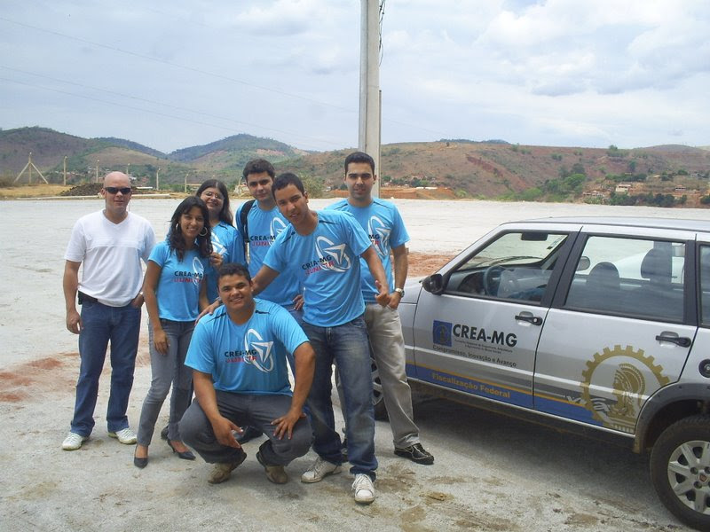
```
]

.footnote[Imagens: Maxwel C Oliveira - aquivo pessoal]

---

## O que vamos falar hoje?


.pull-left[
- Plantas daninhas?

    - O que s√£o?
    - Banco de sementes
    - Planta daninha nos sistemas de produção
  
- Manejo integrado de plantas daninhas

    - Prevenção
    - Controle cultural
    - Controle biológico
    - Controle químico

- Foco em gramíneas forrageiras
    
    - Pastagem 
]


.pull-right[
```{r echo=FALSE, out.width=500, fig.align='center'}
knitr::include_graphics("https://media.giphy.com/media/txCo7WXCwZpmM/giphy.gif")
```
]

---

## Pastagens no Brasil


```{r echo=FALSE, out.width=500, fig.align='center'}
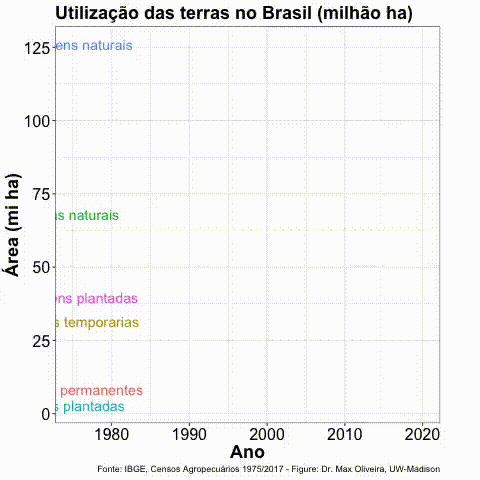
```

---

## Atlas das pastagens

.pull-left[
```{r echo=FALSE, out.width=700, fig.align='center'}
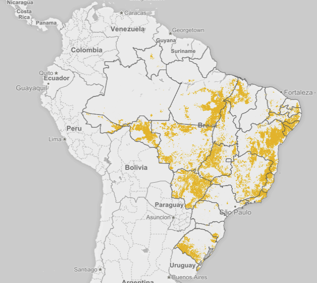
```

.footnote[Fonte: https://pastagem.org/ (UFG - LAPIG)]
]


.pull-right[
```{r echo=FALSE, out.width=700, fig.align='center'}
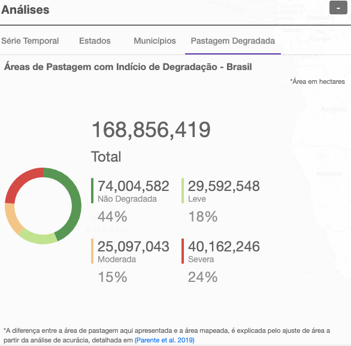
```
]


---

## O que é uma planta daninha?
--


- Plantas que crescem em um local indesej√°vel
--


- Uma planta fora do lugar
--


.pull-left[
```{r echo=FALSE, out.width=450, fig.align='center'}
knitr::include_graphics("https://cropwatch.unl.edu/documents/Volunteer-corn-F3-450.jpg")
```

- Quais plantas s√£o essas?

]

.pull-right[
.footnote[Imagens: CropWatch]
```{r echo=FALSE, out.width=850, fig.align='center'}
knitr::include_graphics("https://cropwatch.unl.edu/image/image_gallery/uuid%3D733c81c2-308e-45c8-a0bb-07ee75545b70%26groupId%3D1841%26t%3D1372797454178")
```

- S√£o plantas daninhas?
]


---

## O que é uma planta daninha?


- Uma planta é daninha porque possui certas características que as diferenciam de outras plantas


> Plantas que interferem no crescimento de plantas desej√°veis e s√£o incomumente persistentes. Eles danificam os sistemas de cultivo de alto valor, os sistemas naturais e as atividades humanas e por isso s√£o indesej√°veis

.pull-left[
```{r echo=FALSE, out.width=400, fig.align='center'}
knitr::include_graphics("images/thistle.jpg")
```
]

.pull-right[
```{r echo=FALSE, out.width=400, fig.align='center'}
knitr::include_graphics("images/poaia.jpg")
```
.footnote[Imagens: Maxwel C Oliveira]

]


---

## Efeitos indesej√°veis

- Impacto na produtividade de plantas de alto valor 


```{r echo=FALSE, out.width=750, fig.align='center'}
knitr::include_graphics("https://pbs.twimg.com/media/DjYfzYpX4AEwny5?format=jpg&name=large")
```
.footnote[Imagem: U of Wisconsin-Madison]

---

## Efeitos indesej√°veis

- Impacto na produtividade de plantas de alto valor (Imagem: Ryan DeWerff)


.pull-left[
```{r echo=FALSE, out.width=250, fig.align='center'}
knitr::include_graphics("https://pbs.twimg.com/media/DjYfyiaW4AAnHXf?format=jpg&name=large")
```
]

.pull-right[
```{r echo=FALSE, out.width=250, fig.align='center'}
knitr::include_graphics("https://pbs.twimg.com/media/DjYf0nVXgAAu8Yi?format=jpg&name=small")
```
]

---

## Efeitos indesej√°veis

```{r echo=FALSE, out.width=700, fig.align='center'}
knitr::include_graphics("images/picao.jpg")
```
.footnote[Imagem: Maxwel C Oliveira]

---

## Efeitos indesej√°veis

- Impacto na produtividade de plantas de alto valor 

```{r echo=FALSE, out.width=600, fig.align='center'}
knitr::include_graphics("images/pastagem_weed.jpg")
```

.footnote[Imagem: Maxwel C Oliveira]

---

## Impacto em animais

- **Veneno**: cafezinho (*Palicourea marcgravi*)

.pull-left[
```{r echo=FALSE, out.width=600, fig.align='center'}
knitr::include_graphics("https://rehagro.com.br/blog/wp-content/uploads/2018/06/plantas-toxicas-de-importancia-pecuaria4.jpg")
```
.footnote[Imagem: rehagro.com.br]
]


.pull-right[
```{r echo=FALSE, out.width=600, fig.align='center'}
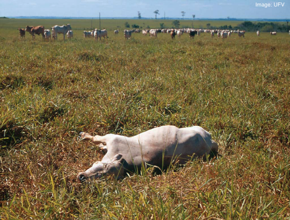
```
]


---

## Impacto em animais

- **Pastejo**: Diminuição da oferta para os animais

```{r echo=FALSE, out.width=550, fig.align='center'}
knitr::include_graphics("https://pastoextraordinario.com.br/wp-content/uploads/2018/11/Pasto_Extraordinario_Como_contolar_plantas_daninhas_nas_pastagens_MG-1024x768.png")
```
.footnote[Imagem: Pasto extraordinario]

---

## Por que as plantas daninhas invadem?

- Agroecossistemas versus Ecossistemas Naturais

- As plantas daninhas/invasoras invadem os ecossistemas de maneira semelhante?
.pull-left[
```{r echo=FALSE, out.width=380, fig.align='center', fig.pos= "middle"}
knitr::include_graphics("images/amazon.jpeg")
```
]

.pull-right[

```{r echo=FALSE, out.width=530, fig.align='center', fig.pos= "middle"}
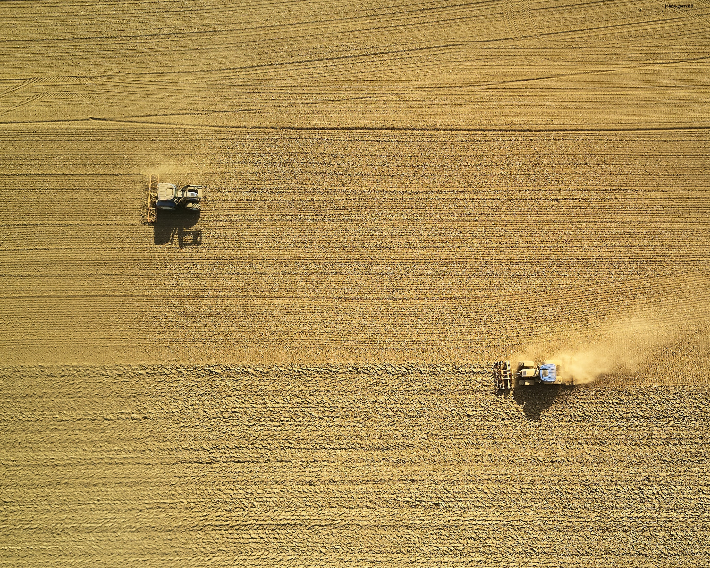
```

]
---

## Sistemas de pastagens 

- Qual sistema tem maior possibilidade de invas√£o de plantas daninhas?

.pull-left[
```{r echo=FALSE, out.width=800, fig.align='center'}
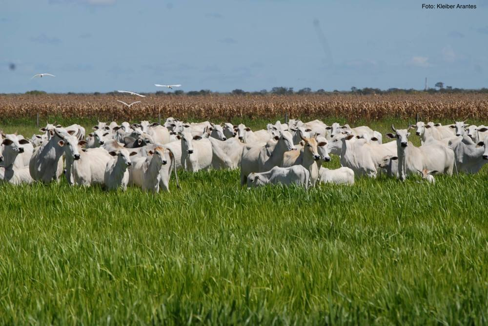
```
]

.pull-right[
```{r echo=FALSE, out.width=800, fig.align='center'}
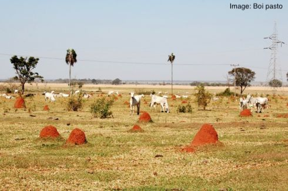
```
]


---


## Sistemas de pastagens 

- Qual sistema tem maior possibilidade de invas√£o de plantas daninhas?

.pull-left[
```{r echo=FALSE, out.width=800, fig.align='center'}
knitr::include_graphics("images/agron.jpg")
```
]

.pull-right[
```{r echo=FALSE, out.width=800, fig.align='center'}
knitr::include_graphics("images/anprosem_1.jpg")
```
]


---

## Sistemas de produção


- Plantas daninhas em sistemas de produção (16 anos)

```{r echo=FALSE, out.width=650, fig.align='center'}
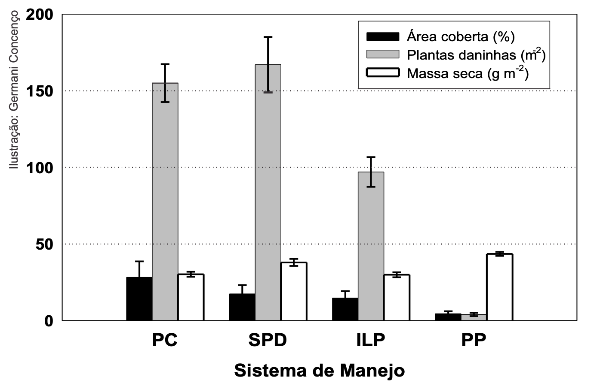
```
.footnote[Fonte: Concenço et al (2011) Dinâmica de Plantas Infestantes em Sistemas Integrados de Cultivo]

---

## O banco de sementes
```{r echo=FALSE, out.width=900, fig.align='center'}
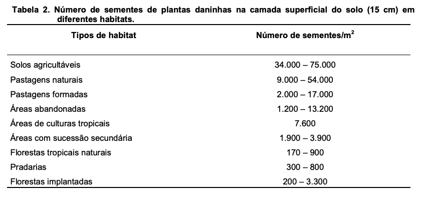
```
.footnote[Fonte: Dr. Ricardo Vitoria Filho, Esalq]


---

## O banco de sementes

```{r echo=FALSE, out.width=800, fig.align='center'}
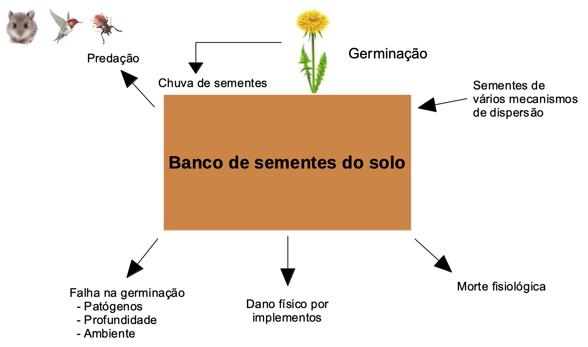
```


---

## O ciclo de vida de uma planta daninha anual

```{r echo=FALSE, out.width=900, fig.align='center'}
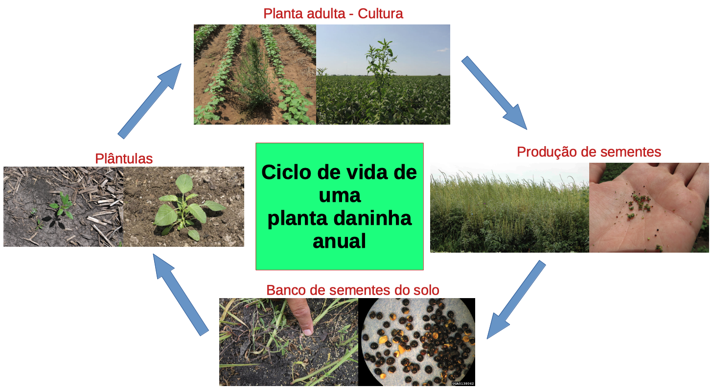
```


---

## Contabilizando as plantas daninhas


```{r echo=FALSE, out.width=900, fig.align='center'}
knitr::include_graphics("images/contabilizando.png")
```


---

## Contabilizando as plantas daninhas

- Amostragem no solo

```{r echo=FALSE, out.width=700, fig.align='center'}
knitr::include_graphics("https://media.giphy.com/media/TJgxOvkuFutLWhX2Or/giphy.gif")
```

.footnote[Gif: giphy.com]


---


## Contabilizando as plantas daninhas

- Contagem de plantas daninhas em sistemas de produção

```{r echo=FALSE, out.width=700, fig.align='center'}
knitr::include_graphics("https://media.giphy.com/media/USVgVUitCduCP9DjKo/giphy.gif")
```

.footnote[Gif: giphy.com]


---

## Plantas daninhas e sistemas de produção

- Os sistemas de produção não usam todos os recursos (água, nutrientes, luz, etc)

- Campo de produção de sementes de *Panicum maximum* cv.Massai
```{r echo=FALSE, out.width=700, fig.align='center'}
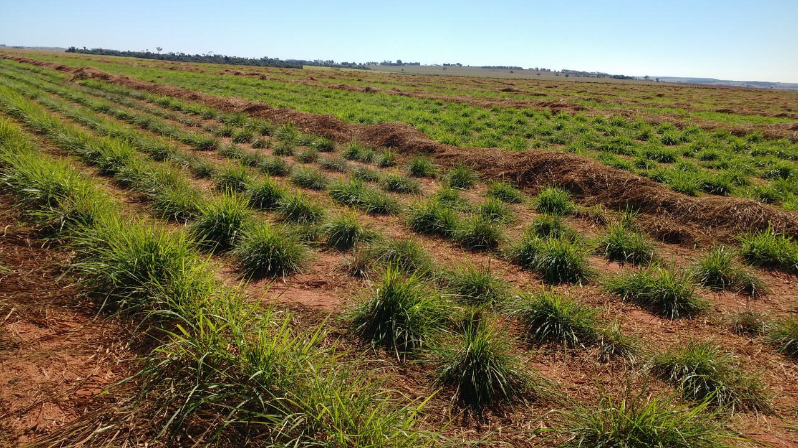
```
.footnote[Imagem: Tiago Catuchi, Unoeste]

---

## Manejo Integrado de Plantas Daninhas (MIPD)


.pull-left[

- Prevenção

- Erradicação

- Controle
  - Cultural
  - Mec√¢nico
  - Biológico
  - Químico

]


.pull-right[
```{r echo=FALSE, out.width=320, fig.align='center'}
knitr::include_graphics("images/MIPD.png")
```
]


---

## Manejo Integrado de Plantas Daninhas


### Três princípios:


.pull-left[
- Abaixar a densidade de equilíbrio para um nível tolerável


- Reduzir a adequação relativa (e efeito) da planta daninha (aumenta a tolerância)


- Mudar a composição das comunidades de plantas daninhas para plantas menos agressivas e fáceis de manejar

]


.pull-right[
```{r echo=FALSE, out.width=500, fig.align='center'}
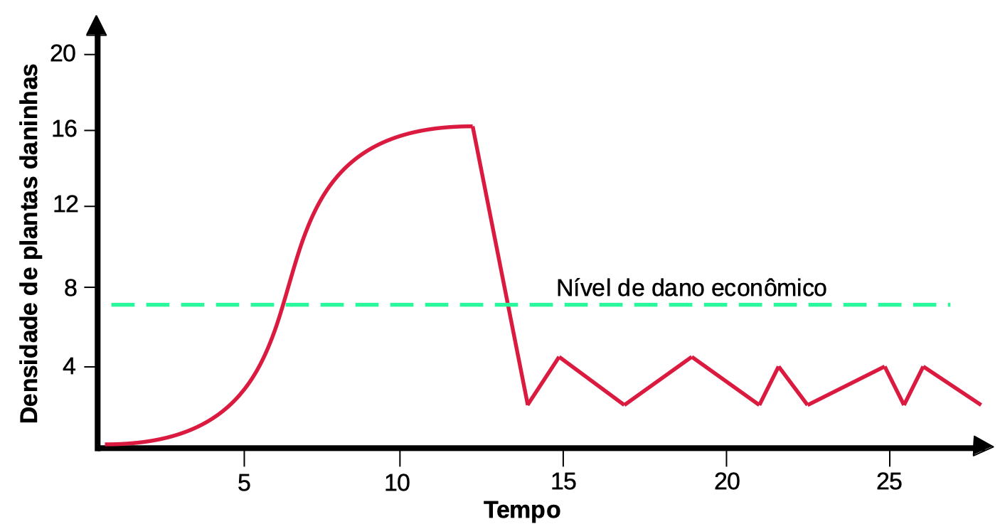
```
]


---

## Conhecer a planta daninha

### Classificação de plantas daninhas

- **História da vida** - ciclo de vida, estação do crescimento, época e método de reprodução (por exemplo: verão / inverno anual, bianunal, perene)

```{r echo=FALSE, out.width=900, fig.align='center'}
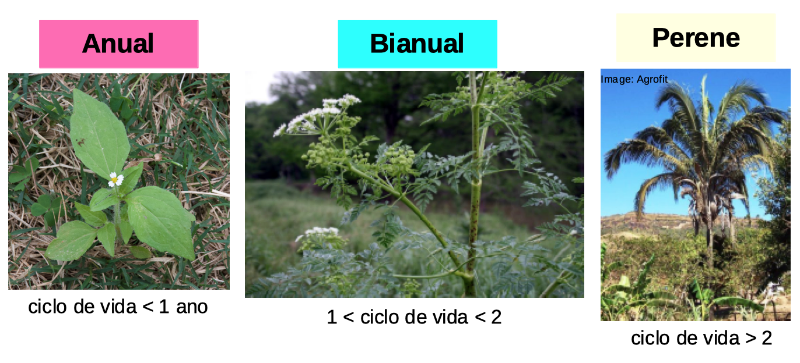
```


---

## Conhecer a planta daninha

### Classificação de plantas daninhas


- **Classificação por estratégia evolutiva** 

```{r echo=FALSE, out.width=900, fig.align='center'}
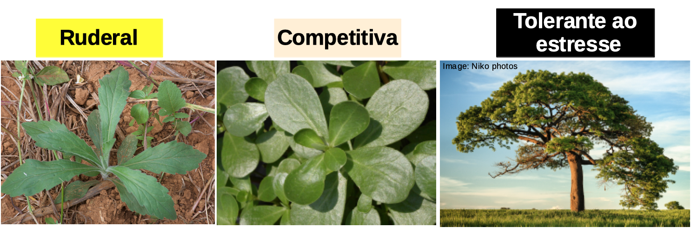
```

---

## Conhecer a planta daninha

```{r echo=FALSE, out.width=700, fig.align='center'}
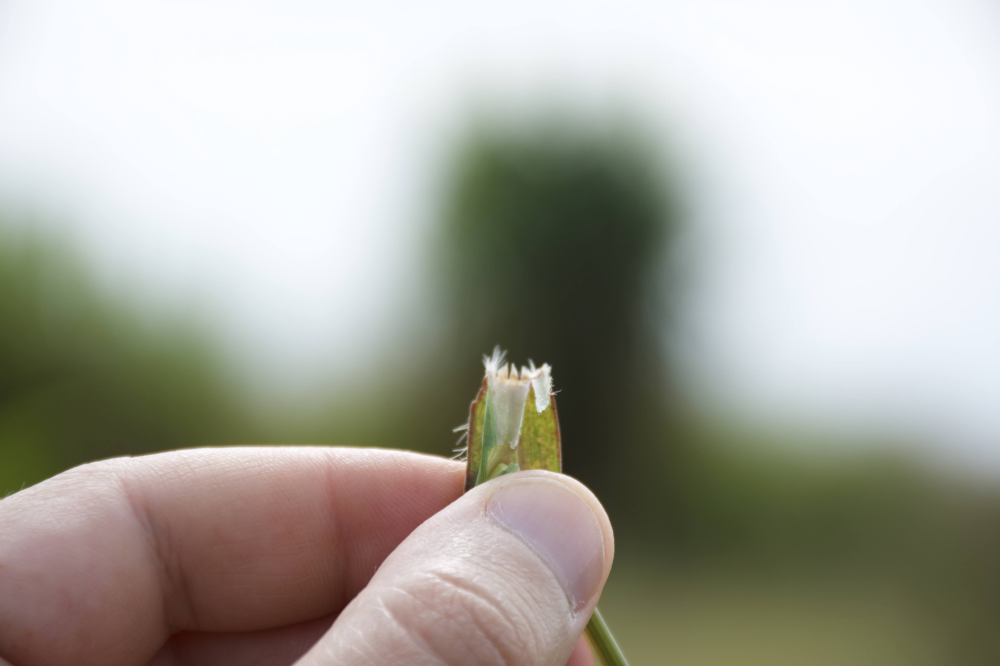
```

.footnote[Imagem: Maxwel C Oliveira]

---

## Conhecer a planta daninha

```{r echo=FALSE, out.width=700, fig.align='center'}
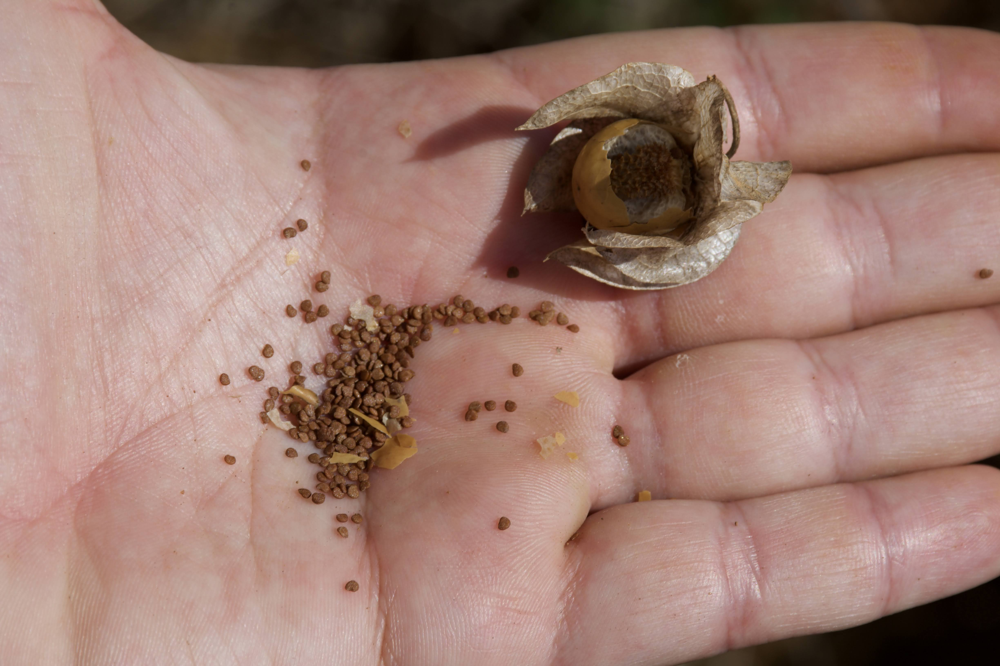
```

.footnote[Imagem: Maxwel C Oliveira]

---

## Conhecer a planta daninha

```{r echo=FALSE, out.width=600, fig.align='center'}
knitr::include_graphics("http://courses.missouristate.edu/pbtrewatha/Johnsongrass9.JPG")
```

.footnote[Imagem: U of Missouri]


---

## Prevenção


**Quarentena**  são usadas para isolar e previnir a propagação de plantas nocivas
  

  
> **Fato:** "Cerca de 85% das plantas que chegam ao País para fins de pesquisa estão contaminadas com pragas" (EMBRAPA)

```{r echo=FALSE, out.width=500, fig.align='center'}
knitr::include_graphics("images/cow.png")
```


---


## Prevenção


**Lei de sementes**  são decretadas para garantir a pureza de sementes de culturas de alto valor econômico e prevenir a dispersão de sementes de plantas daninhas

```{r echo=FALSE, out.width=500, fig.align='center'}
knitr::include_graphics("images/cert_sementes.jpg")
``` 


Acesse aqui a [Lei de sementes no Brasil](http://www.planalto.gov.br/ccivil_03/LEIS/2003/L10.711.htm)

---

### Evitar a contaminação de sementes


```{r echo=FALSE, out.width=700, fig.align='center'}
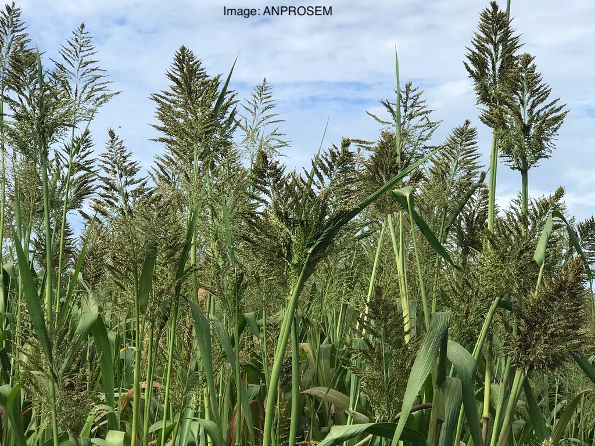
``` 


---

## Prevenção


**Educação** para prevenir a propagação de plantas daninhas requer que individuos sejam capazes de identificar espécies de plantas daninhas/invasoras.


```{r echo=FALSE, out.width=700, fig.align='center'}
knitr::include_graphics("images/education.png")
``` 

---

## Prevenção

### Precauções além de leis e regulações

- N√£o deixe plantas indesej√°veis reproduzirem
--


- N√£o espalhe sementes em √°reas n√£o infestadas
--


- N√£o espalhe estruturas reprodutivas de plantas daninhas ou invasoras
--


- N√£o alimente animais com material contaminado com sementes ou propagulos de plantas daninhas/invasoras
--


- Elimine plantas daninhas antes da fase reprodutiva
--


- Limpeza de equipamentos, m√°quinas, colheitadoras, implementos etc

---

### Limpeza de equipamentos

.pull-left[
```{r echo=FALSE, out.width=400, fig.align='center'}
knitr::include_graphics("images/wiscweeds.png")
``` 
]

.pull-right[
.footnote[Imagem: U of Nebraska-Lincoln]
```{r echo=FALSE, out.width=700, fig.align='center'}
knitr::include_graphics("images/cleaning.jpg")
``` 

- Trabalho na U of Wisconsin demonstra a dispers√£o de plantas daninhas
]

.footnote[Fonte: Nick Arneson]

---

## Controle biológico

- Proposta da Embrapa Koller & Nunes (2006) para o controle de ciganinha (*Memora peregrina*)


.pull-left[
```{r echo=FALSE, out.width=220, fig.align='center'}
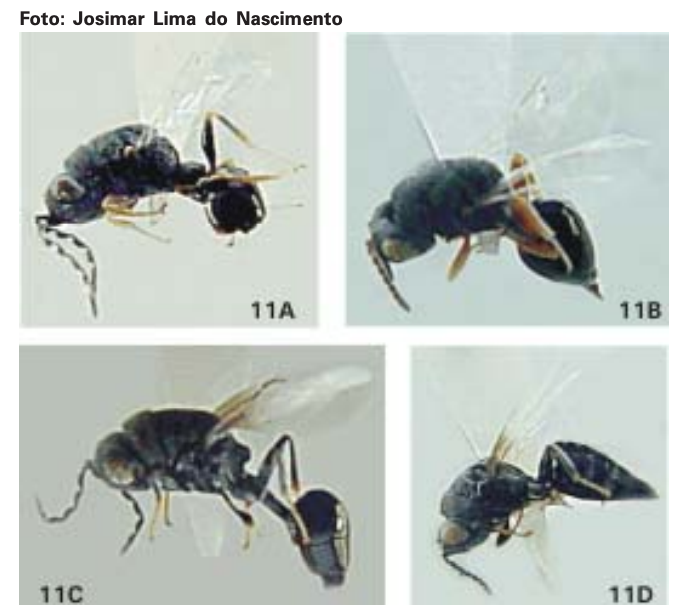
``` 

```{r echo=FALSE, out.width=250, fig.align='center'}
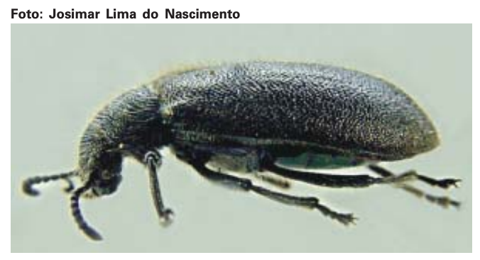
``` 
]

.pull-right[
```{r echo=FALSE, out.width=280, fig.align='center'}
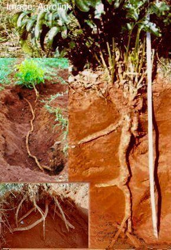
``` 
]


---

## Controle mec√¢nico


```{r echo=FALSE, out.width=600, fig.align='center'}
knitr::include_graphics("images/mowing.jpg")
``` 
.footnote[Imagem: i1.wp.com]


---

## Controle mec√¢nico

- Controle de plantas daninhas arbustivas

- Necessário na integração com herbicidas


.pull-left[
```{r echo=FALSE, out.width=700, fig.align='center'}
knitr::include_graphics("images/eucalipto.jpeg")
``` 
]

.pull-right[
```{r echo=FALSE, out.width=700, fig.align='center'}
knitr::include_graphics("https://media.giphy.com/media/VNdgEiEcRalhe/giphy.gif")
``` 
]

.footnote[Gif: giphy.com]

---

## Controle cultural

.pull-left[
- Sementes sadias

- Integração lavoura pecuária

- Sistemas agroflorestais
]

.pull-right[
- Quantidade de sementes/ha

- Rotação/sucessão de culturas

- Plantas competitivas
]

```{r echo=FALSE, out.width=600, fig.align='center'}
knitr::include_graphics("images/gado_3.jpeg")
```


---

## Sistemas ILP


```{r echo=FALSE, out.width=300, fig.align='center'}
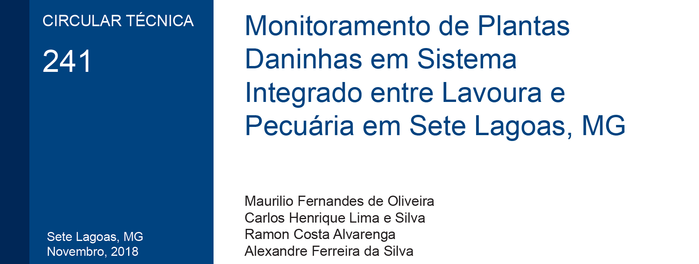
```

.pull-left[
```{r echo=FALSE, out.width=800, fig.align='center'}
knitr::include_graphics("images/ilp_01.png")
```
]


.pull-right[
```{r echo=FALSE, out.width=800, fig.align='center'}
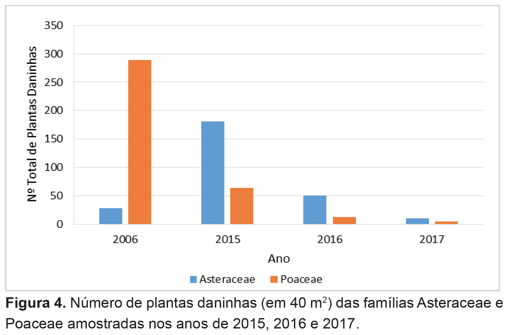
```
]

---

## Sistemas ILP

- Principio do MIPD

    - Mudar a composição das comunidades de plantas daninhas para plantas menos agressivas e fáceis de manejar


```{r echo=FALSE, out.width=600, fig.align='center'}
knitr::include_graphics("images/ilp_03.png")
```

---

## Sistemas ILP

- Tiririca (*Cyperus spp*)

```{r echo=FALSE, out.width=650, fig.align='center'}
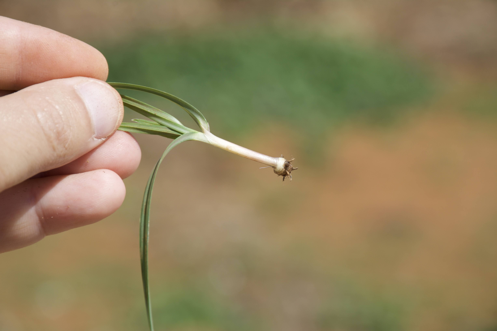
```

.footnote[Imagem: Maxwel C Oliveira]

---

## Sistemas ILP

.pull-left[
- Benéficos econômicos 

- Ciclagem de nutrientes 

- Manejo de planta daninha

- Diversidade de culturas

- Sustentabilidade

- Sequestro de C
]

.pull-right[
```{r echo=FALSE, out.width=800, fig.align='center'}
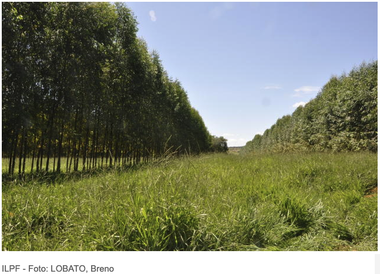
```
]


---

## Controle químico


```{r echo=FALSE, out.width=700, fig.align='center'}
knitr::include_graphics("https://topsul1.webnode.com/_files/200010668-c3abbc4a56/TopSul%20Not%C3%ADcias%20-%20Crissiumal%20-%20RS%20-%20www.topsulnoticias.com.br%20-%20%20herbicida.jpg")
```
.footnote[Imagem: topsul1.webnode.com]


---


## Controle químico

### Alguns conceitos b√°sicos

- Sistêmico vs Contato

```{r echo=FALSE, out.width=700, fig.align='center'}
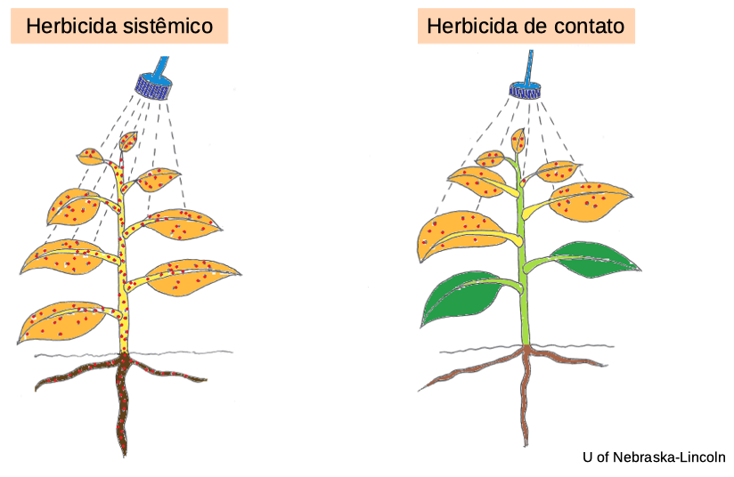
```


---

## Controle químico

### Alguns conceitos b√°sicos

- Seletivo vs N√£o-seletivo


.pull-left[
```{r echo=FALSE, out.width=700, fig.align='center'}
knitr::include_graphics("images/selective.jpg")
```
]


.pull-right[
```{r echo=FALSE, out.width=700, fig.align='center'}
knitr::include_graphics("images/nonselective.jpg")
```
]

.footnote[Imagens: U of Wisconsin-Madison]

---


## Classificação dos Herbicidas no Brasil

- Mecanismos de ação (Folha 1) - https://maxweeds.rbind.io/post/chart/Chart_Herbicida.pdf

```{r echo=FALSE, out.width=650, fig.align='center'}
knitr::include_graphics("https://maxweeds.rbind.io/post/chart/first.png")
```


---

## Classificação dos Herbicidas no Brasil

- Combinação de herbicidas (Folha 2)

```{r echo=FALSE, out.width=650, fig.align='center'}
knitr::include_graphics("https://maxweeds.rbind.io/post/chart/second.png")
```


---

## Controle químico no Brasil


```{r echo=FALSE, out.width=500, fig.align='center'}
knitr::include_graphics("images/culturas.png")
```


---

## Herbicidas registrados para gramíneas forrageiras

- Contendo 1 ingrediente ativo

| Grupo | Ingrediente ativo    | Quantidade | Produto comercial<sup>®</sup> 
|-------------------|----------------------|:------------:|-----------------|      
| G                 | glifosato            | 67         | Nufosate e outros |
| O                 | 2,4-D                | 39         | DMA 806 BR e outros |
| O                 | picloram             | 15         | Danado e outros       |
| O                 | triclopir-butolitico | 10         | Garlon e outros    |
| B                 | metsulfurom-metilico | 6          | Ally e outros       |
| C1,2              | tebutiurom           | 2          | Lava 100, Graslan 100            |
| O                 | fluroxipir-meptilico | 1          | Starane 200         |
| E                 | carfentrazona-etílica| 1          | Spotlight           |
| E                 | saflufenacil         | 1          | Heat                |
| B                 | imazetapir           | 1          | Imazetapir 106 BR   |
.footnote[Fonte: Agrofit Mapa]


---

## Herbicidas registrados para gramíneas forrageiras

- Contendo 2 ou 3 ingredientes ativos

| Grupo | Ingrediente ativo      | Quantidade | Produto comercial<sup>®</sup>                  |
|-------------------|---------------------------|:------------:|-----------------------------|
| O + O   | 2,4-D + picloram     | 31         |  Jacaré e outros    |
| O + O   | fluroxipir-meptilico + picloram    |  10        | Arreio e outros    |
| O + O   | 2,4-D + aminopiralide   |   9        | Tordon XT e outros         |
| O + O + O  | aminopiralide + picloram + triclopir-butotilico |  3    | Dominum XT, Trueno XT, Planador XT |
| O + O + O  | aminopiralide + fluroxipir-meptilico + picloram |  3 | DominumXT-S, PlanadorXT-S, TruenoXT-S    |
| O + O  | aminopiralide + fluroxipir-meptilico        |    2       | Dominum, Trueno    |
| O + O  | fluroxipir-meptilico + triclopir-butotilico |    2       | Truper          |
| O + B  | aminopiralide + metsulfurom-metilico        |    1       | Chaparral          |
| B + B  | imazapique + imazapir                       |    1       | Kifix              |
| O + O  | picloram + triclopir-butotilico             |   1        | Togar TB            |
.footnote[Fonte: Agrofit Mapa]

---


## Herbicidas para gramíneas forrageiras

```{r echo=FALSE, out.width=800, fig.align='center'}
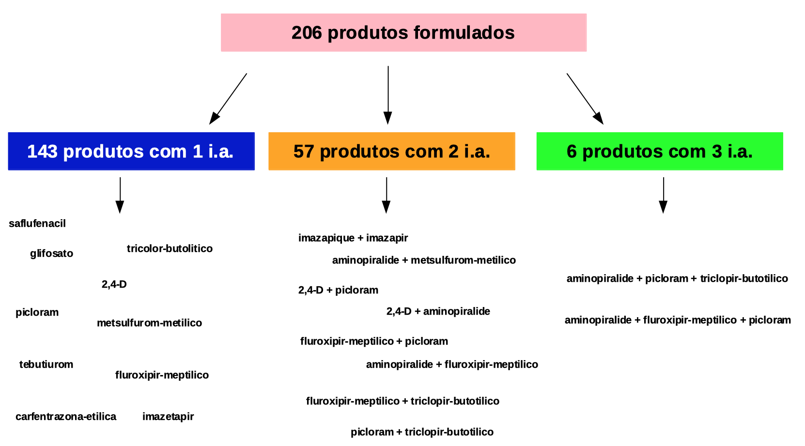
```


---

## Plantas daninhas 

- Plantas controladas com os herbicidas registrados para gramíneas forrageiras

- 108 espécies (89 dicot e 19 monocot)

```{r echo=FALSE, out.width=700, fig.align='center'}
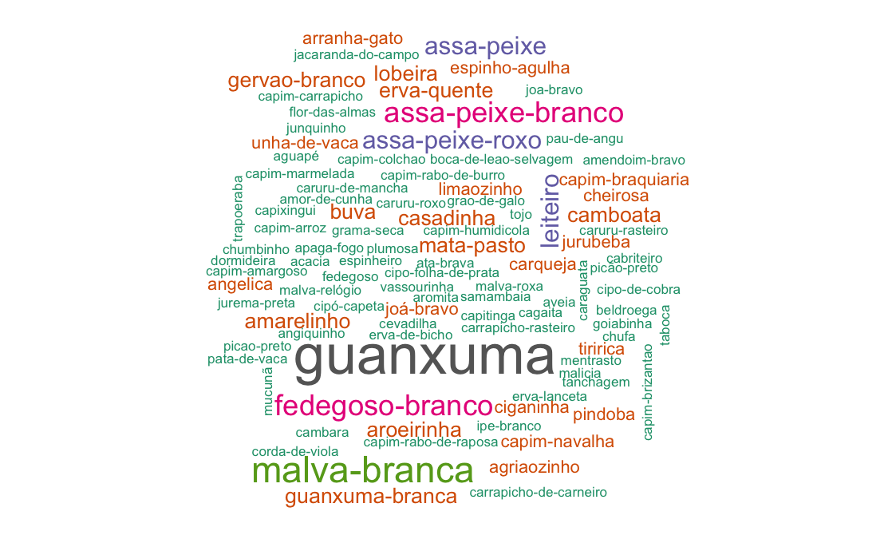
```

---


```{r echo=FALSE, out.width=600, fig.align='center'}
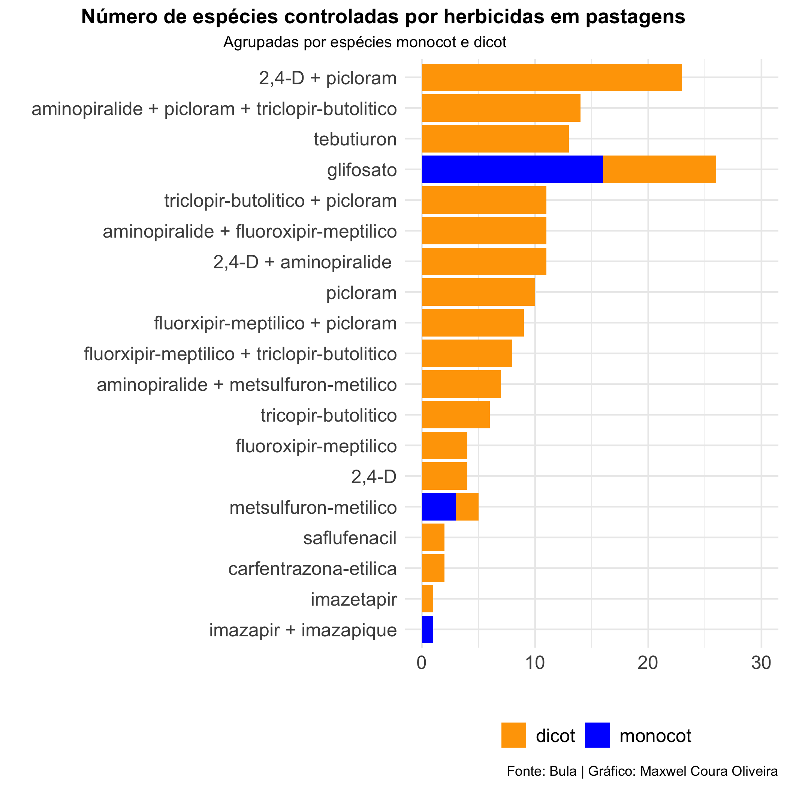
```


---


```{r echo=FALSE, out.width=600, fig.align='center'}
knitr::include_graphics("images/MdA.png")
```

---

class: inverse, center, middle

# Grupo G (Inibidores da EPSPS)

glifosato

```{r echo=FALSE, out.width=600, fig.align='center'}
knitr::include_graphics("images/glyphosate.png")
```

---

## Grupo G (Inibidores da EPSPS)

- Herbicida sistemico

- N√£o-seletivo

```{r echo=FALSE, out.width=600, fig.align='center'}
knitr::include_graphics("images/gly_drybean.jpg")
```


---


## Grupo G (Inibidores da EPSPS)

### Glifosate (Várias formulações)

.pull-left[
- Herbicida n√£o-seletivo

- Dessecação

- Renovação de pastagens

- Aplicação foliar dirigida

- Dose (0,5 a 2,5 kg ae ha<sup>-1</sup>)

- Amplo espectro de controle

    - Folhas largas
    - Folhas estreitas
]


.pull-right[

- Aplicação dirigida

```{r echo=FALSE, out.width=500, fig.align='center'}
knitr::include_graphics("images/foliar_1.png")
```

]


---

class: inverse, center, middle

## Grupo C1,2 (Inibidores da Fotossíntese no FSII)

tebutiuron

```{r echo=FALSE, out.width=600, fig.align='center'}
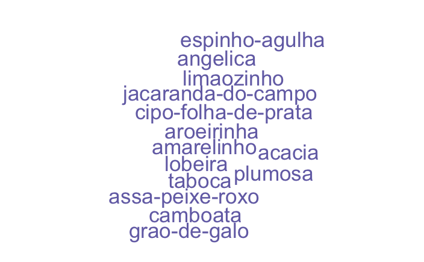
```


---


## Grupo C1,2 (Inibidores da Fotossíntese no FSII)

- Herbicida sistêmico (via xilema)

```{r echo=FALSE, out.width=600, fig.align='center'}
knitr::include_graphics("images/simazine_SB.jpg")
```


---

## Grupo C1,2 (Inibidores da Fotossíntese no FSII)

.pull-left[
- tebutiuron (Graslan 100)

- Controle de espécies arbustivas

- Dose: 20 a 80 g pc ha<sup>-1</sup>

- Produto peletizado


- Lobeira (*Solanum lycocarpum*)
```{r echo=FALSE, out.width=320, fig.align='center'}
knitr::include_graphics("images/lobeiro.jpeg")
```
]


.pull-right[
- Jacarand√° do campo (*Machaerium acutifolium*)
```{r echo=FALSE, out.width=300, fig.align='center'}
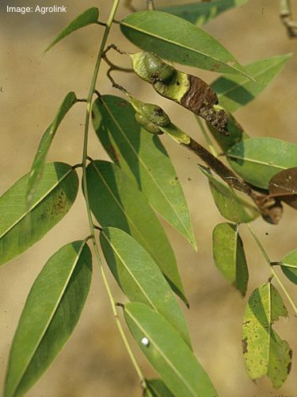
```
]


---

### Tebutiuron

- Aplicação: Distribuindo-se o produto uniformemente ao redor da planta em calda ou em peletes

.pull-left[
```{r echo=FALSE, out.width=300, fig.align='center'}
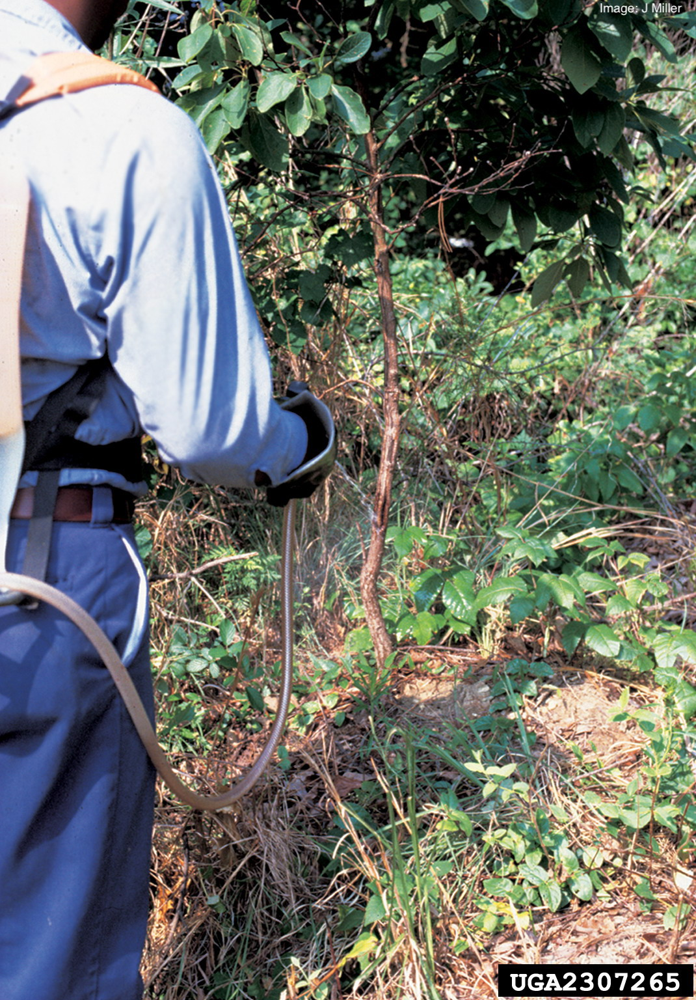
```
]

.pull-right[
```{r echo=FALSE, out.width=450, fig.align='center'}
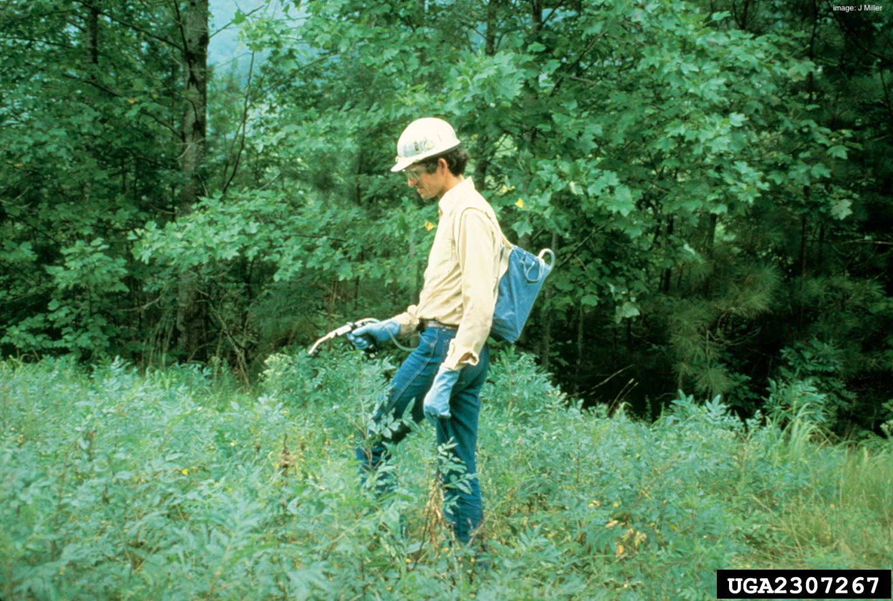
```

- Absorção pelas raízes
]

---

### Tebutiuron

- amarelinho (*Tecoma stans*)

.pull-left[
Passini et al. (1997)
```{r echo=FALSE, out.width=600, fig.align='center'}
knitr::include_graphics("images/tebu.png")
```
]

.pull-right[
```{r echo=FALSE, out.width=600, fig.align='center'}
knitr::include_graphics("images/tecoma.jpg")
```
]

- A menor dose de tebutiuron foi suficiente para matar as plantas
num período de nove meses após a aplicação do herbicida

---

class: inverse, center, middle

# Grupo B (Inibidores da ALS)

imazapique + imazapir, imazetapir

```{r echo=FALSE, out.width=600, fig.align='center'}
knitr::include_graphics("images/grupo_b.png")
```

---

## Grupo B (Inibidores da ALS)

- Herbicidas sistêmicos

- Clorose, folhas roxas, retarda o crescimento, inibe raízes

.pull-left[
```{r echo=FALSE, out.width=600, fig.align='center'}
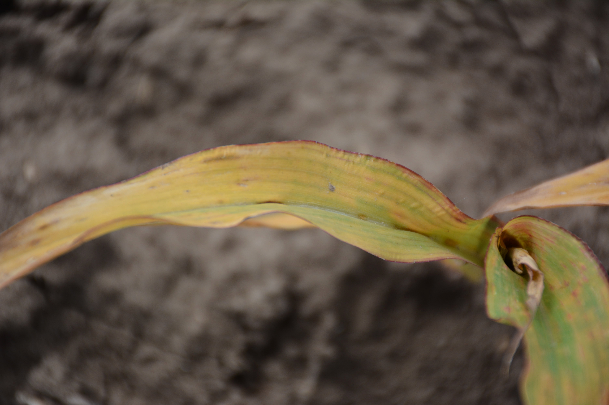
```
]


.pull-right[
```{r echo=FALSE, out.width=500, fig.align='center'}
knitr::include_graphics("images/als_3.jpg")
```

.footnote[Imagens: Maxwel C Oliveira]

]


---

## Grupo B (Inibidores da ALS)

- Herbicidas sistêmicos

- Clorose, folhas roxas, retarda o crescimento, inibe raízes

.pull-left[
```{r echo=FALSE, out.width=600, fig.align='center'}
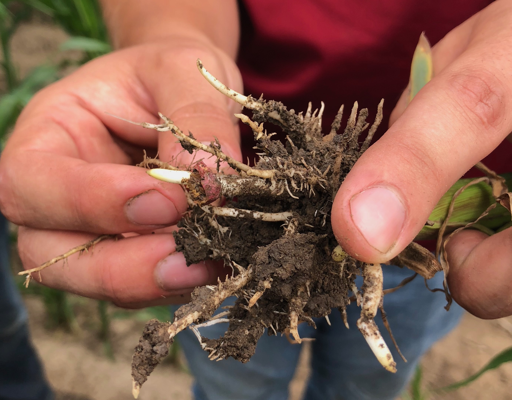
```
]


.pull-right[
```{r echo=FALSE, out.width=600, fig.align='center'}
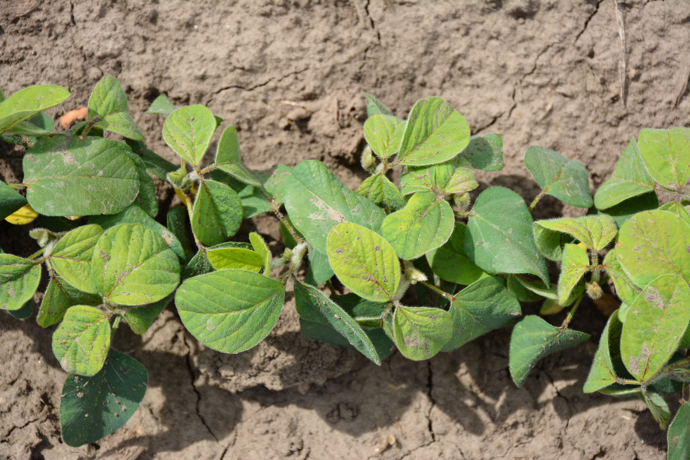
```

.footnote[Imagem: Maxwel C Oliveira]
]


---

## Grupo B (Inibidores da ALS)

.pull-left[
- **imazapique + imazapir** (Kifix<sup>®</sup> - 300 a 400 g pc ha<sup>-1</sup>)

- PÓS com pastagem formada (> 1 ano)

- Pode ser observado clorose até 90 dias

```{r echo=FALSE, out.width=270, fig.align='center'}
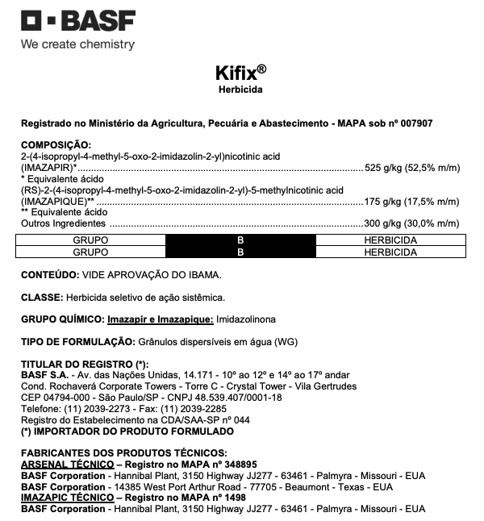
```
]


.pull-right[

- **imazetapir** (Imazetapir 106 BR - 3 a 6 L pc ha<sup>-1</sup>)

- Uso de adjuvantes

- capim-navalha (*Paspalum urvillei*)
```{r echo=FALSE, out.width=300, fig.align='center'}
knitr::include_graphics("images/navalha.jpg")
```
]


---

## Grupo B (Inibidores da ALS)


- **metsulfurom-metilico** (Ally<sup>®</sup> - 6,6 a 13,3 g pc ha<sup>-1</sup> + OM)

- Pré e pós-emergência

- Aplicação em área total ou localizada

> Controla gramíneas forrageiras desejáveis


.pull-left[
Gerv√£o branco (*Croton glandulosus*)
```{r echo=FALSE, out.width=200, fig.align='center'}
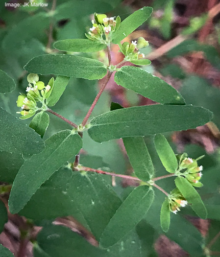
```

]

.pull.right[

Guanxuma (*Sida* spp.)
```{r echo=FALSE, out.width=300, fig.align='center'}
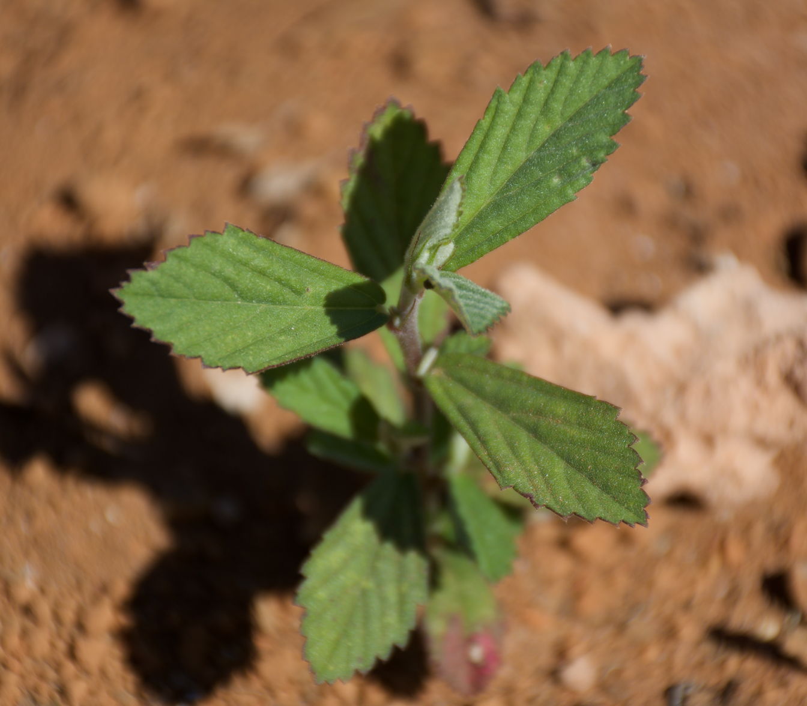
```
.footnote[Imagem: Maxwel C Oliveira]

]


---

class: inverse, center, middle

# Grupo E (Inibidores da PPO/PROTOX)

carfentrazona-etílica, saflufenacil

```{r echo=FALSE, out.width=500, fig.align='center'}
knitr::include_graphics("images/grupo_e.png")
```

---

## Grupo E (Inibidores da PPO/PROTOX)

- Herbicidas de contato (foliar)

- Queimam a folha

- Absorvidos pelas raízes

.pull-left[
```{r echo=FALSE, out.width=400, fig.align='center'}
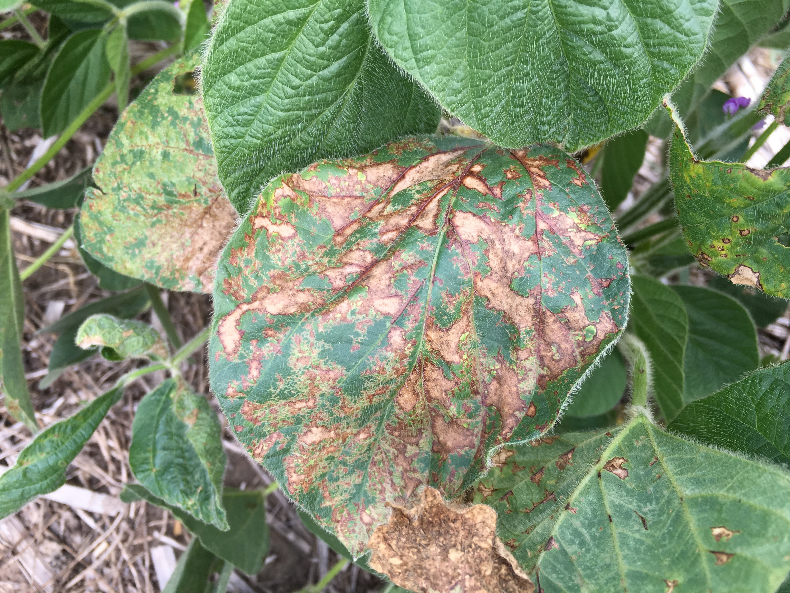
```
]

.pull-right[
```{r echo=FALSE, out.width=400, fig.align='center'}
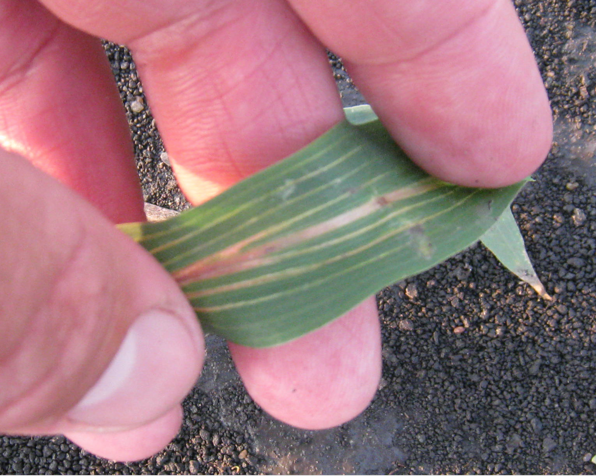
```
]

.footnote[Imagem: Maxwel C Oliveira]

---


## Grupo E (Inibidores da PPO/PROTOX)

- **carfentrazona-etílica** (Spotlight<sup>®</sup> 75 a 125 mL pc ha<sup>-1</sup>)

.pull-left[

- Aplicação foliar em área total

- Herbicida de contato / cobertura

- PÓS-emergência

- Reforma: 30 a 60 dias após o plantio

> Aplicar em epóca de época de intenso crescimento das plantas daninhas

```{r echo=FALSE, out.width=300, fig.align='center'}
knitr::include_graphics("images/spotlight.png")
```

]


.pull-right[
- corda de viola (*Ipomoea* spp)
```{r echo=FALSE, out.width=250, fig.align='center'}
knitr::include_graphics("images/corda_viola.jpg")
```


- trapoeraba (*Commelina* spp.)
```{r echo=FALSE, out.width=200, fig.align='center'}
knitr::include_graphics("images/trapoeraba.jpg")
```
]


---

## Grupo E (Inibidores da PPO/PROTOX)


- **saflufenacil** (Heat<sup>®</sup> 70-100 g pc ha<sup>-1</sup>)

.pull-left[

> *Brachiaria brizantha*, *Brachiaria decumbens* e *Panicum maximum* cv. Tobiat√£.

- Aplicação foliar em área total

- Pós-emergência

- Planta daninha (2 a 8 folhas)

```{r echo=FALSE, out.width=400, fig.align='center'}
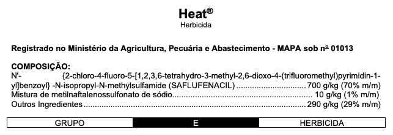
```
]


.pull-right[
- Guanxuma (*Sida* spp.)
```{r echo=FALSE, out.width=200, fig.align='center'}

```
.footnote[Imagem: Maxwel C Oliveira]


- buva (*Conyza* spp.)
```{r echo=FALSE, out.width=200, fig.align='center'}
knitr::include_graphics("images/bonariensis_03.png")
```
]

---

### Saflufenacil (Heat<sup>®</sup>)

- Seletivo para gramíneas

```{r echo=FALSE, out.width=700, fig.align='center'}
knitr::include_graphics("images/sharpen.jpg")
```
.footnote[Imagem: U of Wisconsin-Madison]

---

class: inverse, center, middle

# Grupo O (Mimetizadores da auxina)

aminopiralide, picloram, fluroxipir-meptílico, triclopir-butotílico, 2,4-D

```{r echo=FALSE, out.width=600, fig.align='center'}
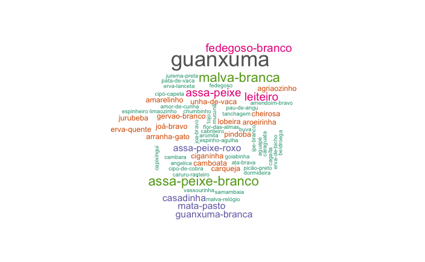
```

---


## Mimetizadores da auxina

### Cinco classes de hormônios que afetam o crescimento das plantas:

- **Auxinas** - estimulam o crescimento das plantas

- **Citocininas** - promovem a divis√£o celular, efeitos vari√°veis

- **Giberelinas** - alongamento do caule e do caule da flor, efeitos vari√°veis

- **Etileno** - amadurecimento e maturação

- **Ácido abscísico** - efeitos variados “o hormônio do estresse”

<br>

> Herbicidas do grupo mimetizadores da auxina *mimetizam* o hormônio da *auxina* resultando em uma série de anormalidades de crescimento

---

## Grupo O (Mimetizadores da auxina)


.pull-left[
- Herbicida sistêmico

- Controlam plantas daninhas de folha larga

- Seletivo para gramíneas

- As gramíneas são tolerantes porque metabolizam rápida e irreversivelmente o ingrediente ativo em compostos não tóxicos
]


.pull-right[
```{r echo=FALSE, out.width=600, fig.align='center'}
knitr::include_graphics("images/auxin.jpg")
```
]


---

## Grupo O (Mimetizadores da auxina)


.pull-left[
```{r echo=FALSE, out.width=300, fig.align='center'}
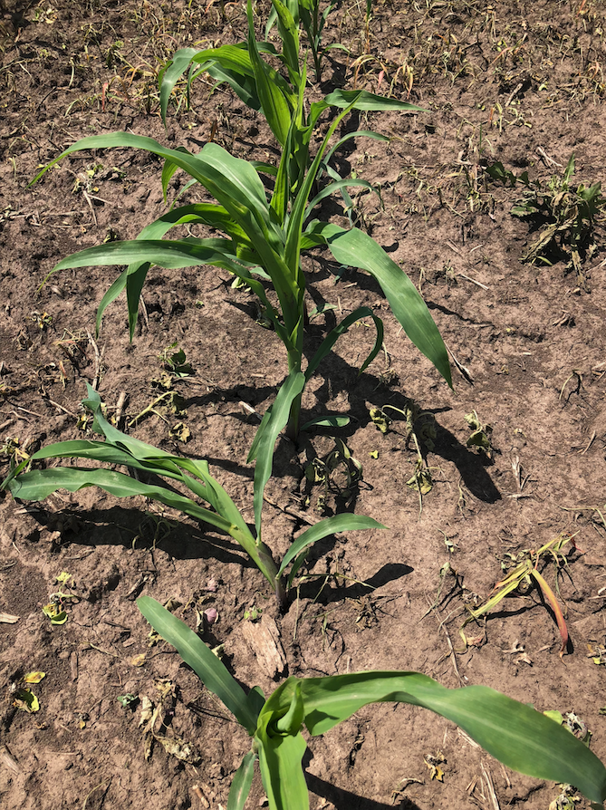
```
]

.footnote[Imagem: Maxwel C Oliveira]

.pull-right[
```{r echo=FALSE, out.width=700, fig.align='center'}
knitr::include_graphics("images/auxin_2.jpeg")
```

.footnote[Imagem: Tiago Catuchi, Unoeste]
]

---

## Grupo O (Mimetizadores da auxina)

| Grupo | Família química            | Ingrediente ativo    |
|-------|----------------------------|----------------------|
|       | Carboxilatos de piridina   | aminopiralide        |
|       |                            | picloram             |
| O     | Carboxilatos de piridiloxi | fluroxipir-meptílico |
|       |                            | triclopir-butotílico |
|       | Carboxilatos de fenoxi     | 2,4-D                |


- Herbicidas que controlam apenas plantas de folhas largas (dicot)

.pull-left[
```{r echo=FALSE, out.width=270, fig.align='center'}
knitr::include_graphics("images/assapeixe.jpg")
```
]

.pull-right[
```{r echo=FALSE, out.width=290, fig.align='center'}
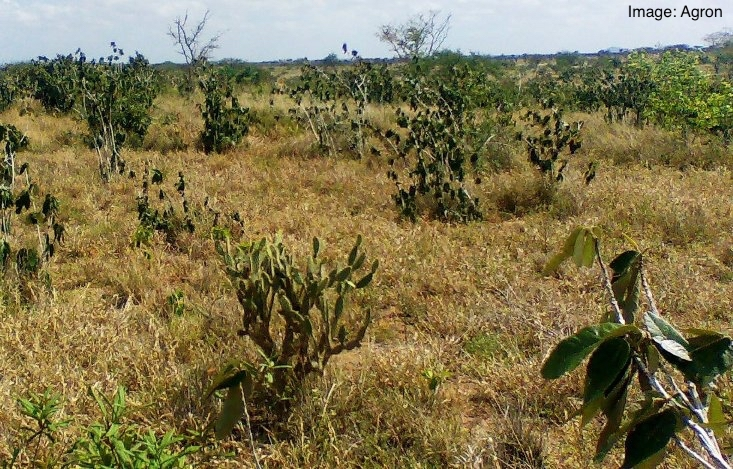
```
]


---

## Grupo 0 (Mimetizadores da auxina)


- **picloram** (Danado<sup>®</sup> - 1 a 2 L pc ha<sup>-1</sup> em 100 L)

- Controle de plantas daninhas de folha larga de porte arbóreo, arbustivo e sub-arbustivo

- Corte e aplicação no toco

- Trate a circunferência de caules e todo o topo de pequenos caules


.pull-left[
```{r echo=FALSE, out.width=400, fig.align='center'}
knitr::include_graphics("images/invasive_5.jpg")
```
]

.pull-right[
```{r echo=FALSE, out.width=400, fig.align='center'}
knitr::include_graphics("images/invasive_4.jpg")
```
]


---

### Métodos de aplicação de hebicidas no tronco


.pull-left[
```{r echo=FALSE, out.width=400, fig.align='center'}
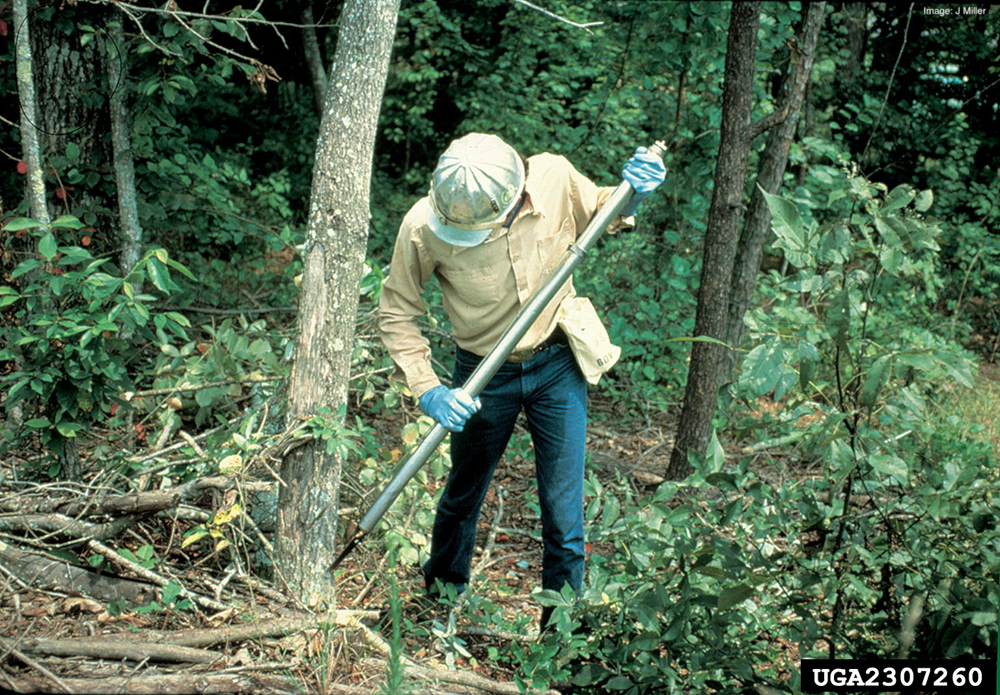
```

```{r echo=FALSE, out.width=300, fig.align='center'}
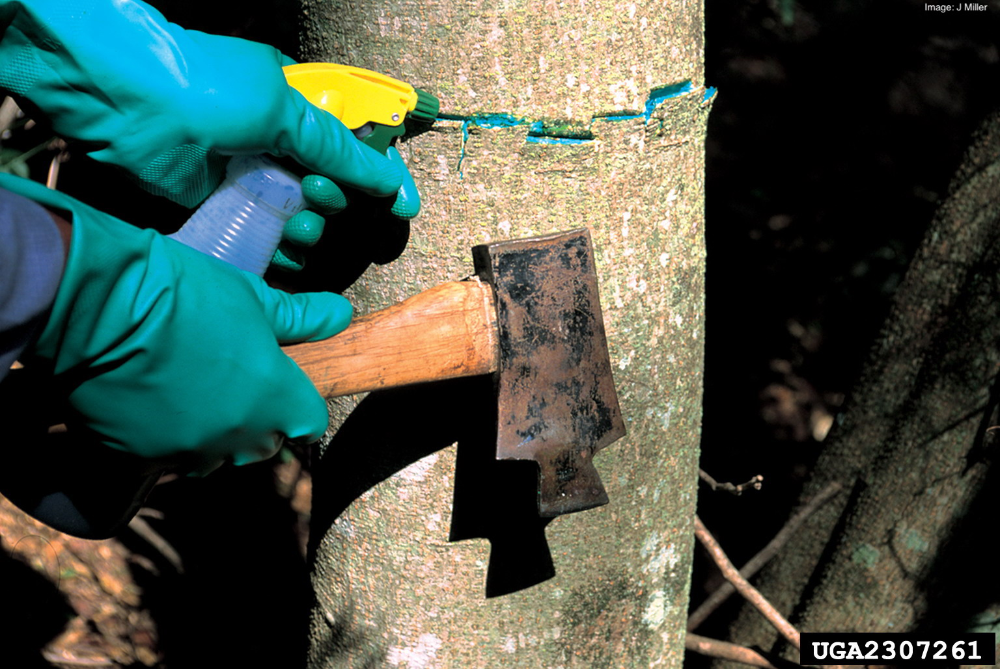
```
]

.pull-right[
```{r echo=FALSE, out.width=300, fig.align='center'}
knitr::include_graphics("images/invasive_3.jpg")
```

```{r echo=FALSE, out.width=350, fig.align='center'}
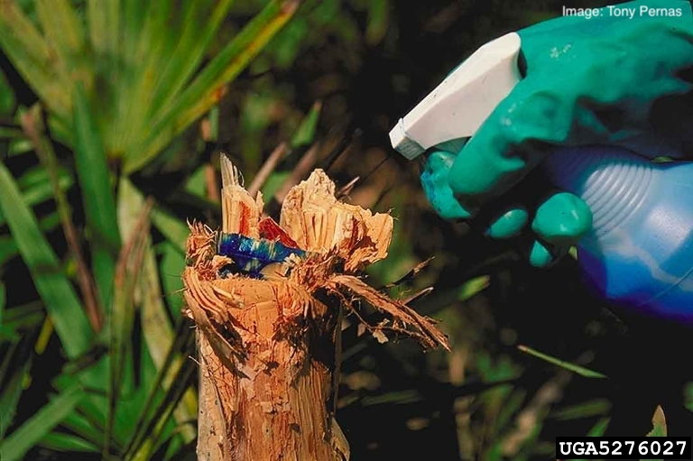
```
]


---

## Grupo 0 (Mimetizadores da auxina)


.pull-left[
- **triclopir-butotilico** (Garlon<sup>®</sup> 480 BR - 0,4 a 2 L pc ha<sup>-1</sup>)

    - Controle em √°rea total ou basal dirigida

- **picloram + triclopir-butotilico** (Tolgar TB - 6 a 8% (v/v) - 150 L)

    - Específico para aplicação basal dirigida
    
```{r echo=FALSE, out.width=150, fig.align='center'}
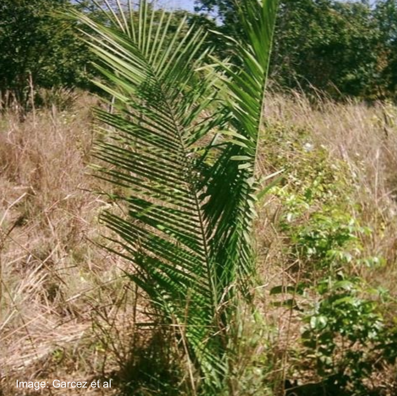
```   
   
    
]

.pull-right[
- Mistura com óleo diesel em aplicação dirigida

```{r echo=FALSE, out.width=350, fig.align='center'}
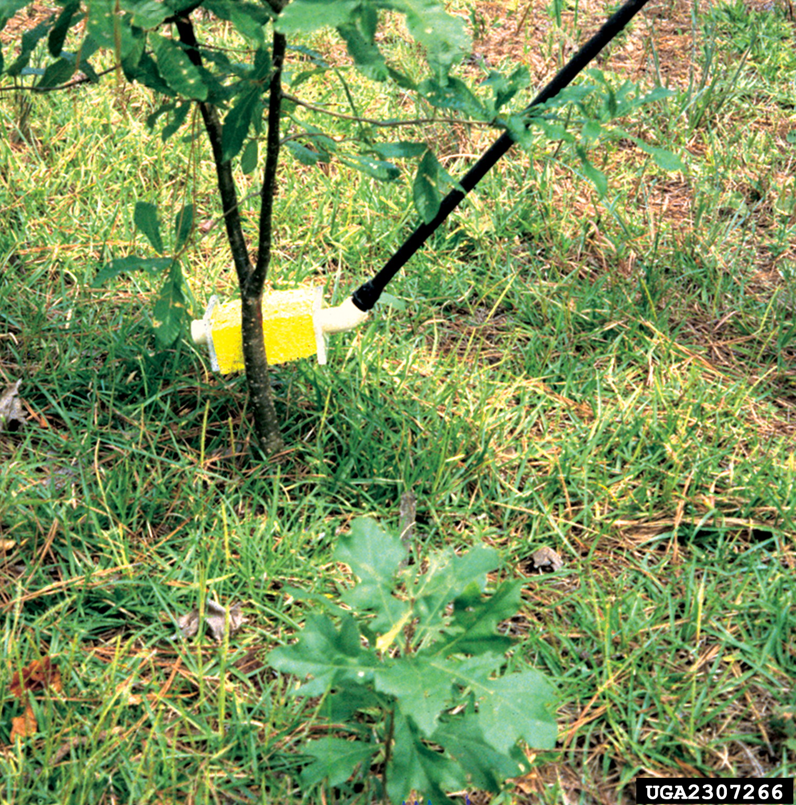
```
]


---

## Controle

```{r echo=FALSE, out.width=400, fig.align='center'}
knitr::include_graphics("images/amarelinho_2.png")
```

```{r echo=FALSE, out.width=900, fig.align='center'}
knitr::include_graphics("images/amarelinho_1.png")
```


---

## Grupo 0 (Mimetizadores da auxina)

- **aminopiralide + picloram + triclopir-butotilico** (XT<sup>®</sup> - 0,5 a 5 L pc ha<sup>-1</sup>)

- **aminopiralide + fluroxipir-meptilico + triclopir-butotilico** (XT-S<sup>®</sup>)

- 3 mecanismos de ação

- Controle de plantas daninhas de folha larga de porte arbóreo, arbustivo e sub-arbustivo

- Pós-emergente de plantas daninhas

```{r echo=FALSE, out.width=400, fig.align='center'}
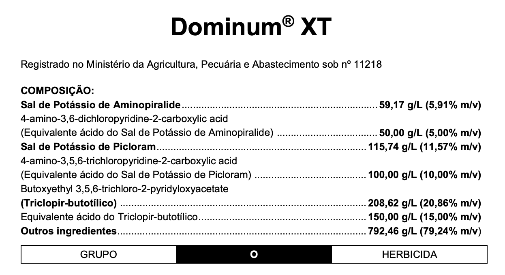
```

---


## Grupo 0 (Mimetizadores da auxina)

- **fluroxipir-meptilico + aminopiralide** (Dominum<sup>®</sup> - 1 a 2,5 L pc ha<sup>-1</sup>)

- **fluroxipir-meptilico + picloram** (Arreio Pasto<sup>®</sup> - 1,5 a 2,5 L pc ha<sup>-1</sup>)

- **fluroxipir-meptilico + triclopir-butotilico** (Truper<sup>®</sup> - 2 a 4 L pc ha<sup>-1</sup>)

- **2,4-D + aminopiralide** (Tordon XT<sup>®</sup> - 1 a 2,5 L pc ha<sup>-1</sup>)

- **2,4-D + picloram** (Jacaré<sup>®</sup> - 3,5 a 5 L pc ha<sup>-1</sup>)

    - Aplicação foliar área total / dirigida (costal)

    -  Folhas largas, semi-arbustivas e arbustivas em áreas de pastagens de gramíneas forrageiras

    - Reforma e manutenção de pastagem / área total 


---

## Novo herbicida

- florpyrauxifen-benzyl + 2,4-D

- Novo produto em teste

- Controle de planta daninha em gramíneas forrageiras com baixas injúrias em algums espécies de leguminsas

Fonte: Dias et al (2020)


---


## Considerações com o controle químico

### Aplicação foliar localizada/basal?


```{r echo=FALSE, out.width=1000, fig.align='center'}
knitr::include_graphics("https://s7d4.scene7.com/is/image/dpagco/IMG_spraying_mesquite_1_Beauty_2_88-1?$textonimage_desktop$")
```
.footnote[Imagem: Corteva-EUA]

---

### Aplicação aérea?

```{r echo=FALSE, out.width=900, fig.align='center'}
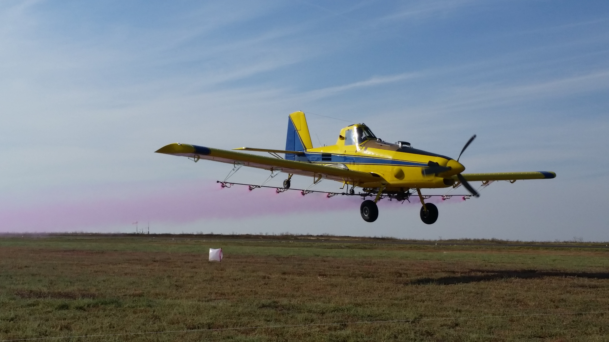
```
.footnote[Imagem: Bruno C Vieira]

---

### Aplicação em área total?


```{r echo=FALSE, out.width=800, fig.align='center'}
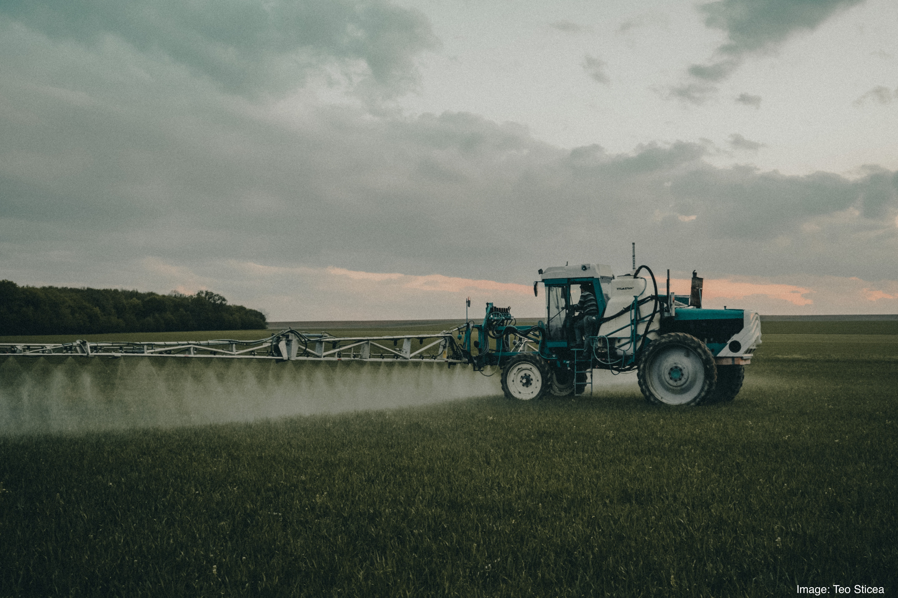
```


---

### Enxada química?


```{r echo=FALSE, out.width=700, fig.align='center'}
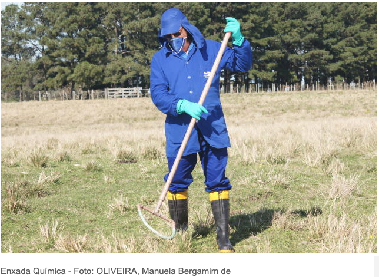
```

---


## Tecnologia de aplicação


.pull-left[
- Volume da calda

- Bicos

- Press√£o de trabalho
]

.pull-right[
- Temperatura

- Umidade

- Vento
]

<br>


```{r echo=FALSE, out.width=800, fig.align='center'}
knitr::include_graphics("images/drop_1.png")
```

---

## Tecnologia de aplicação

### Qual bico escolher?

- Qual a vaz√£o dos bicos?


.pull-left[
```{r echo=FALSE, out.width=800, fig.align='center'}
knitr::include_graphics("images/bicos.png")
```
]

.pull-right[
```{r echo=FALSE, out.width=200, fig.align='center'}
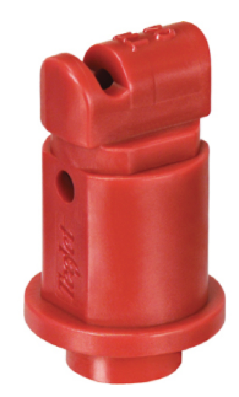
```
]


---

## Tecnologia de aplicação

```{r echo=FALSE, out.width=700, fig.align='center'}
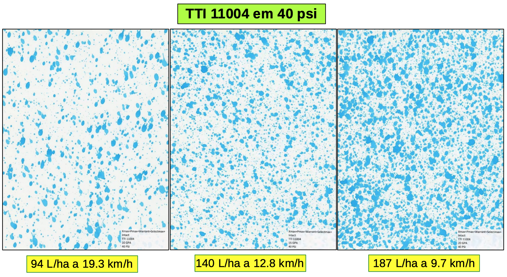
```
.footnote[Imagem: Tommy Butts, U of Arkansas]

---


## Tecnologia de aplicação

- Doses

- Cobertura

```{r echo=FALSE, out.width=500, fig.align='center'}
knitr::include_graphics("images/misapplication.jpeg")
```

---

## Tecnologia de aplicação

- Misturas de herbicidas


```{r echo=FALSE, out.width=400, fig.align='center'}
knitr::include_graphics("https://media.giphy.com/media/XDdeAjKMIo3JFTPA8q/giphy.gif")
```
.footnote[Gif: giphy.com]
---

## Cuidados

.pull-left[
### Residual de herbicidas
- Picloram em café (Fonte: UFV)
```{r echo=FALSE, out.width=400, fig.align='center'}
knitr::include_graphics("images/picloram.png")
```
]

.pull-right[
### Deriva
- Deriva de 2,4-D/dicamba em soja
```{r echo=FALSE, out.width=500, fig.align='center'}
knitr::include_graphics("images/auxin_3.jpg")
```
]


---

## Cuidados

- Classificac√£o toxicologia/meio ambiente

- Manuseio dos produtos

- Siga sempre a bula

```{r echo=FALSE, out.width=800, fig.align='center'}
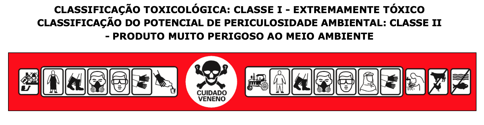
```


---


## Considerações finais

- Manejo de plantas daninhas faz parte do sistema de produção de gramíneas forrageiras/sementes

    - As plantas daninhas s√£o onipresentes
--

- O manejo de pastagem no Brasil permite a integração com outras culturas

    - Sistemas agroflorestais
    - Integração lavoura pecuária
    - Rotação de culturas
--

- Herbicidas facilitam o manejo de plantas daninhas em gramíneas forrageiras
    
    - Boas opcões de produtos químicos
    - Faltam dados de posicionamento
          - Qual a melhor época de aplicação?


---

class: middle, center, inverse

# Quais perguntas vocês tem?

---

name: goodbye
class: right, middle, blue


# Obrigado!

### Me encontre no...

[`r icon::fa("twitter")` @maxwelco](http://twitter.com/maxwelco)  
[`r icon::fa("github")` @maxwelco](http://github.com/maxwelco)  
[`r icon::fa("link")` maxweeds.rbind.io/pt/](https://maxweeds.rbind.io/pt/)  
[`r icon::fa("paper-plane")` maxweloliveira@unoeste.br](mailto:maxweloliveira@unoeste.br)


Maxwel Coura Oliveira


```{r eval=FALSE, include=FALSE}
xaringanExtra::use_webcam()
```


```{r xaringan-tachyons, echo=FALSE, include=FALSE}
xaringanExtra::use_tachyons()
```

```{r xaringan-tile-view, echo=FALSE, include=FALSE}
xaringanExtra::use_tile_view()
```


```{r share-again, echo=FALSE, include=FALSE}
xaringanExtra::use_share_again()
```

```{r broadcast, echo=FALSE, include=FALSE}
xaringanExtra::use_broadcast()
```