```{r setup, include=FALSE}
options(htmltools.dir.version = FALSE)
```

```{r xaringan-themer, include=FALSE, warning=FALSE}
library(xaringanthemer)
style_duo_accent(
  primary_color = "#1335AE",
  secondary_color = "#FF961C",
  inverse_header_color = "#FFFFFF"
)
```


```{r meta, echo=FALSE}
library(metathis)
meta() %>%
  meta_general(
    description = "Circuito Técnico 26 e 27 - Benefícios do Manejo de Canpos de Sementes Forrageiras e Grandes Sistema ILP",
    generator = "xaringan and remark.js"
  ) %>% 
  meta_name("github-repo" = "maxwel/palestra-pastagens") %>% 
  meta_social(
    title = "Manejo de Plantas Daninhas em Sistemas de Produção de Pastagem",
    url = "https://maxweeds.netlify.app/planta-daninha-pastagens",
    image = "https://alison.netlify.app/latinr-learn/images/web.jpg",
    image_alt = "A spiderweb from rawpixel",
    og_type = "website",
    twitter_card_type = "summary_large_image"
  )
```

# Quem sou eu?

- Maxwel Coura Oliveira (maxweloliveira@unoeste.br)

.pull-left[

- Minha história acadêmica

    - **Graduação**: UFVJM 

    - **Mestrado**: UFVJM 

    - **Doutorado**: University of Nebraska-Lincoln

    - **Pós-doutorado**: University of Wisconsin-Madison
    
    - **Professor**: Universidade do Oeste Paulista
    
    - **Blog**: [https://maxweeds.rbind.io/pt/](https://maxweeds.rbind.io/pt/)
]

.pull-right[
```{r echo=FALSE, out.width=350, fig.align='center'}
knitr::include_graphics("images/maxwel_2.jpg")
```
]

---

# CREA

- Crea Jr núcleo Diamantina, MG

.pull-left[
```{r echo=FALSE, out.width=700, fig.align='center'}
knitr::include_graphics("images/crea.jpg")
```
]

.pull-right[
```{r echo=FALSE, out.width=700, fig.align='center'}
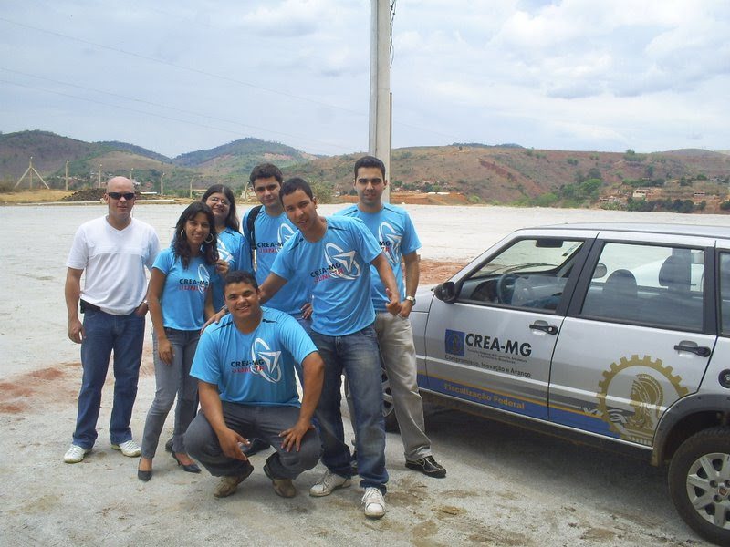
```
]


---

# O que vamos falar hoje?


.pull-left[
- Plantas daninhas?

    - O que são?
    
    - Banco de sementes
    
    - Planta daninha nos sistemas de produção
  
- Manejo integrado de plantas daninhas

    - Prevenção
    
    - Controle cultural
    
    - Controle biológico
    
    - Controle químico

- Foco em pastagens
]


.pull-right[
```{r echo=FALSE, out.width=500, fig.align='center'}
knitr::include_graphics("https://media.giphy.com/media/txCo7WXCwZpmM/giphy.gif")
```
]

---

# Pastagens no Brasil


```{r echo=FALSE, out.width=500, fig.align='center'}
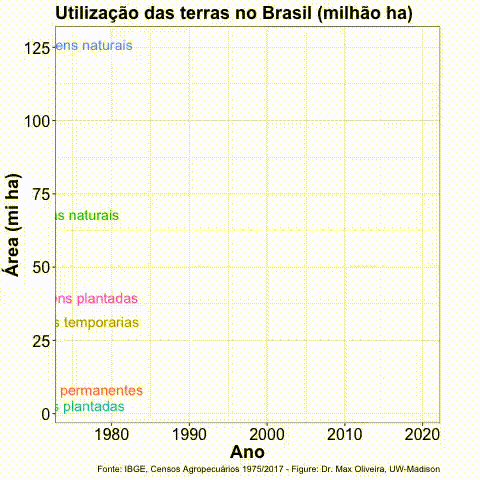
```

---

# Atlas das pastagens

.pull-left[
```{r echo=FALSE, out.width=700, fig.align='center'}
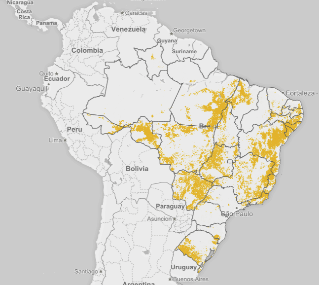
```
]


.pull-right[
```{r echo=FALSE, out.width=700, fig.align='center'}
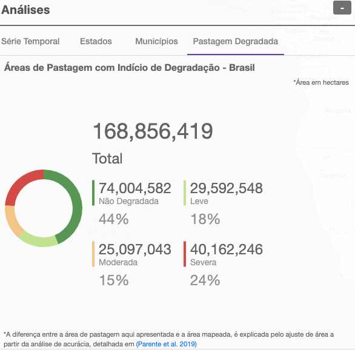
```
]


Fonte: https://pastagem.org/ (UFG - LAPIG)


---

# O que é uma planta daninha?
--


- Plantas que crescem em um local indesejável
--


- Uma planta fora do lugar
--


.pull-left[
```{r echo=FALSE, out.width=500, fig.align='center'}
knitr::include_graphics("https://cropwatch.unl.edu/documents/Volunteer-corn-F3-450.jpg")
```

- Quais plantas são essas?

]

.pull-right[
```{r echo=FALSE, out.width=800, fig.align='center'}
knitr::include_graphics("https://cropwatch.unl.edu/image/image_gallery/uuid%3D733c81c2-308e-45c8-a0bb-07ee75545b70%26groupId%3D1841%26t%3D1372797454178")
```

- São plantas daninhas?
]


---

# O que é uma planta daninha?


- Uma planta é daninha por que possui certas características que as diferenciam de outras plantas


> Plantas que interferem no crescimento de plantas desejáveis e são incomumente persistentes. Eles danificam os sistemas de cultivo de alto valor, os sistemas naturais e as atividades humanas e por isso são indesejáveis

.pull-left[
```{r echo=FALSE, out.width=500, fig.align='center'}
knitr::include_graphics("https://pbs.twimg.com/media/EeQNnXWXsAA-DzM?format=jpg&name=large")
```
]

.pull-right[
```{r echo=FALSE, out.width=250, fig.align='center'}
knitr::include_graphics("https://cdn6.dissolve.com/p/D869_39_138/D869_39_138_1200.jpg")
```
]


---

# Efeitos indesejáveis

- Impacto na produtividade de plantas de alto valor 


```{r echo=FALSE, out.width=800, fig.align='center'}
knitr::include_graphics("https://pbs.twimg.com/media/DjYfzYpX4AEwny5?format=jpg&name=large")
```
Imagem: U of Wisconsin-Madison

---

# Efeitos indesejáveis

- Impacto na produtividade de plantas de alto valor 


.pull-left[
```{r echo=FALSE, out.width=250, fig.align='center'}
knitr::include_graphics("https://pbs.twimg.com/media/DjYfyiaW4AAnHXf?format=jpg&name=large")
```
]

.pull-right[
```{r echo=FALSE, out.width=250, fig.align='center'}
knitr::include_graphics("https://pbs.twimg.com/media/DjYf0nVXgAAu8Yi?format=jpg&name=small")
```
]

Fonte: Ryan DeWerff - U of Wisconsin-Madison


---

# Efeitos indesejáveis

- Impacto na produtividade de plantas de alto valor 

```{r echo=FALSE, out.width=600, fig.align='center'}
knitr::include_graphics("images/pastagem_weed.jpg")
```


---

# Impacto em animais

- **Veneno**: cafezinho (*Palicourea marcgravi*)

.pull-left[
```{r echo=FALSE, out.width=600, fig.align='center'}
knitr::include_graphics("https://rehagro.com.br/blog/wp-content/uploads/2018/06/plantas-toxicas-de-importancia-pecuaria4.jpg")
```
Imagem: rehagro.com.br
]


.pull-right[
```{r echo=FALSE, out.width=600, fig.align='center'}
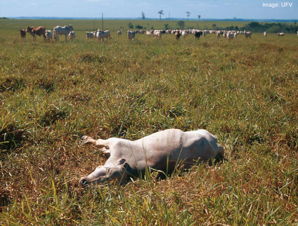
```
]


---

# Impacto em animais

- **Pastejo**: Diminuição da oferta para os animais

```{r echo=FALSE, out.width=600, fig.align='center'}
knitr::include_graphics("https://pastoextraordinario.com.br/wp-content/uploads/2018/11/Pasto_Extraordinario_Como_contolar_plantas_daninhas_nas_pastagens_MG-1024x768.png")
```
Imagem: Pasto extraordinario

---

# Por que as plantas daninhas invadem?

- Agroecossistemas versus Ecossistemas Naturais


.pull-left[
```{r echo=FALSE, out.width=400, fig.align='center', fig.pos= "middle"}
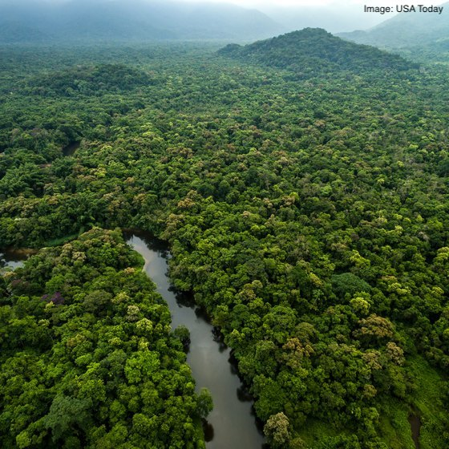
```
]

.pull-right[

```{r echo=FALSE, out.width=550, fig.align='center', fig.pos= "middle"}
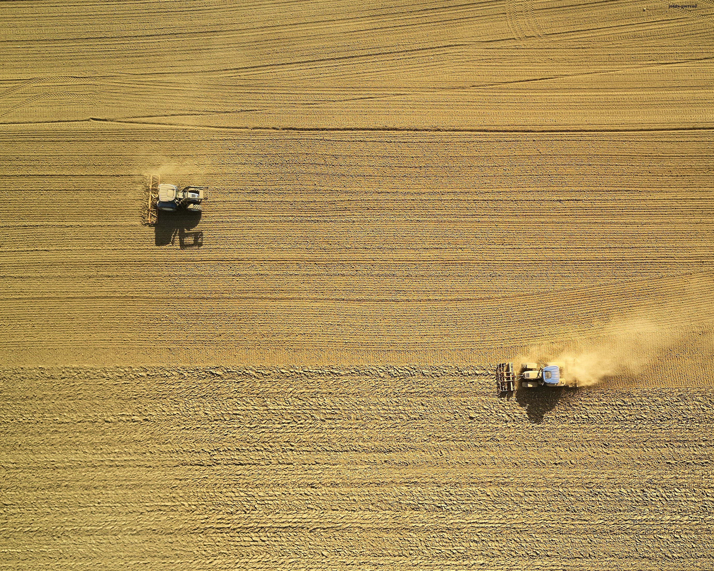
```

]

- As plantas daninhas/invasoras invadem os ecossistemas de maneira semelhante?


---

# Sistemas de produção


- Plantas daninhas em sistemas de produção (16 anos)

```{r echo=FALSE, out.width=650, fig.align='center'}
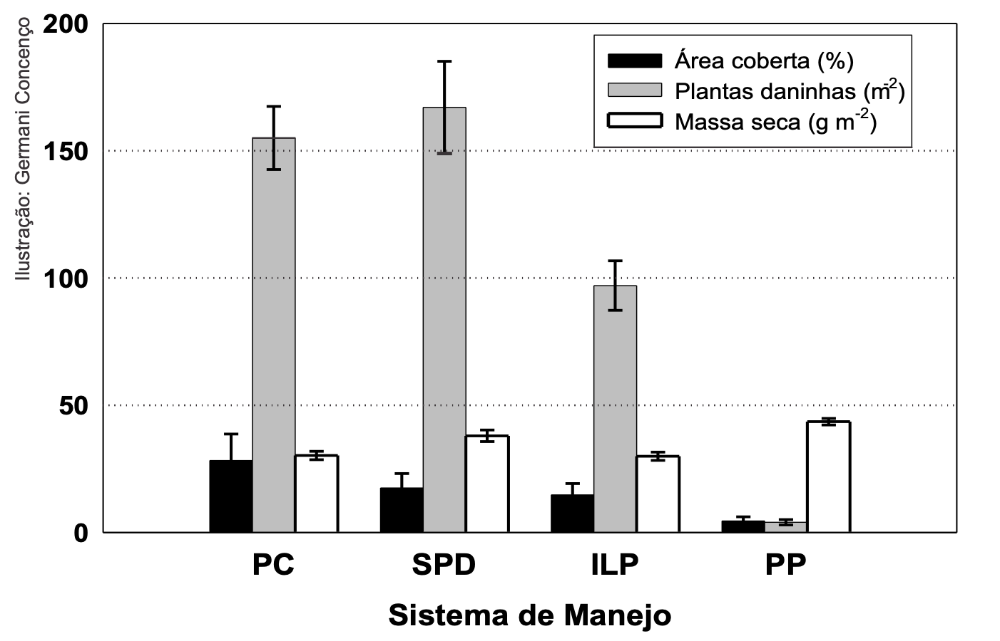
```
Fonte: Concenço et al (2011) Dinâmica de Plantas Infestantes em Sistemas Integrados de Cultivo


---

# Sistemas de pastagens 

- Qual sistema tem maior possibilidade de invasão de plantas daninhas?

.pull-left[
```{r echo=FALSE, out.width=800, fig.align='center'}
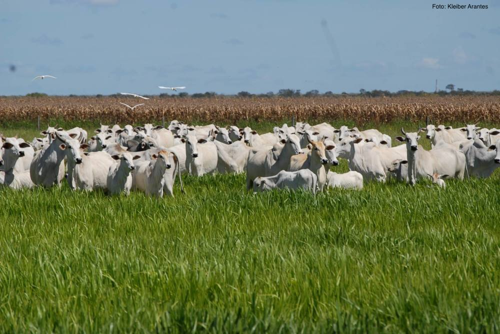
```
]

.pull-right[
```{r echo=FALSE, out.width=800, fig.align='center'}
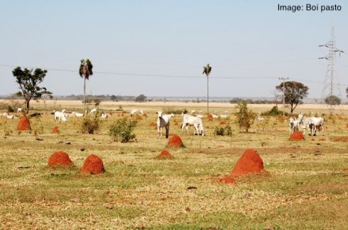
```
]


---


# Sistemas de pastagens 

- Qual sistema tem maior possibilidade de invasão de plantas daninhas?

.pull-left[
```{r echo=FALSE, out.width=800, fig.align='center'}
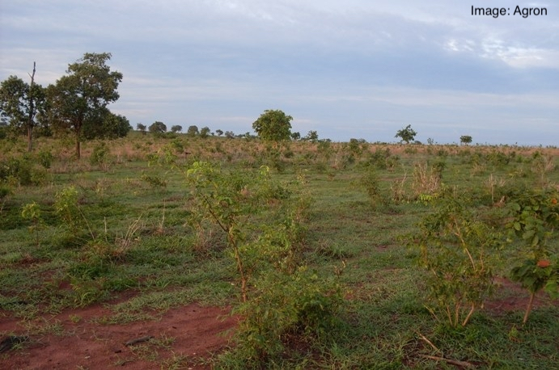
```
]

.pull-right[
```{r echo=FALSE, out.width=800, fig.align='center'}
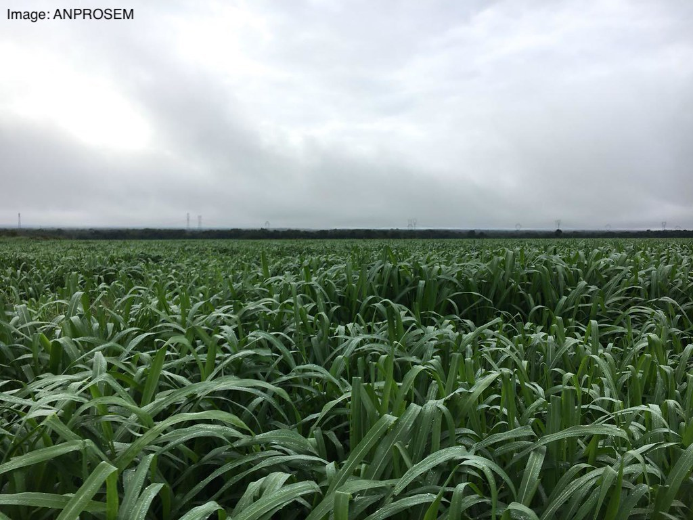
```
]


---

# O banco de sementes

```{r echo=FALSE, out.width=800, fig.align='center'}
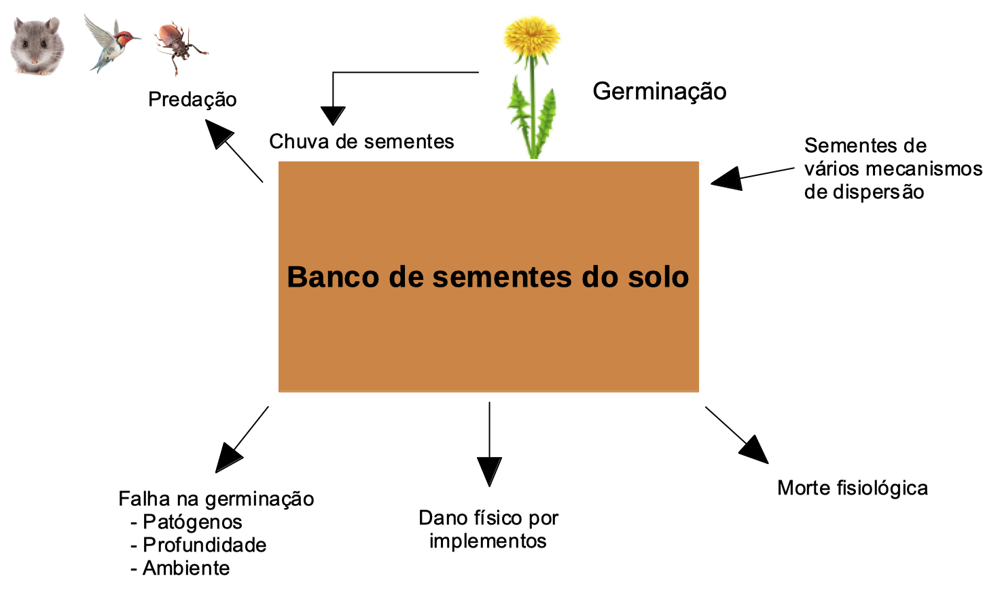
```

---

# O banco de sementes
```{r echo=FALSE, out.width=900, fig.align='center'}
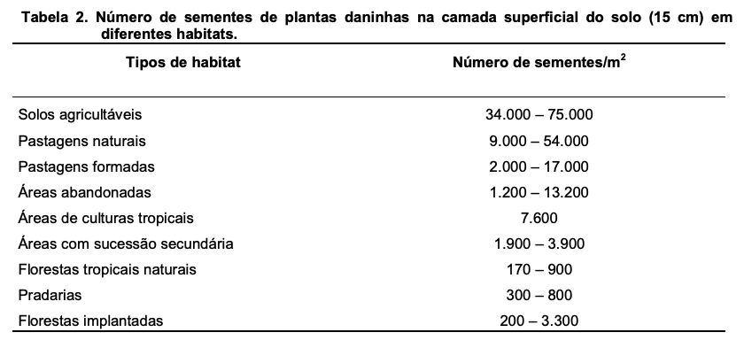
```
Fonte: Dr. Ricardo Vitoria Filho, Esalq

---

# O ciclo de vida de uma planta daninha anual

```{r echo=FALSE, out.width=900, fig.align='center'}
knitr::include_graphics("images/ciclo_2.png")
```


---

# Contabilizando as plantas daninhas


```{r echo=FALSE, out.width=900, fig.align='center'}
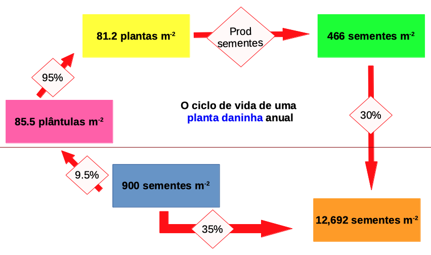
```


---

# Plantas daninhas e sistemas de produção

- Os sistemas de produção não usa todos os recursos (água, nutrientes, luz, etc)

- Campo de produção de sementes de *Panicum maximum* cv.Massai
```{r echo=FALSE, out.width=800, fig.align='center'}
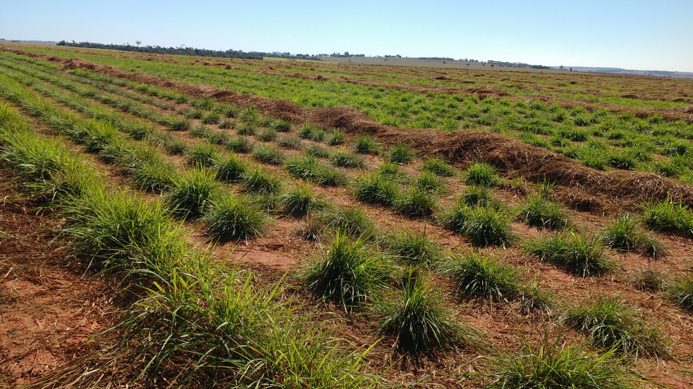
```
Imagem: Tiago Catuchi, Unoeste

---

# Manejo Integrado de Plantas Daninhas (MIPD)


.pull-left[

- Prevenção

- Erradicação

- Controle
  - Cultural
  - Mecânico
  - Biológico
  - Químico

]


.pull-right[
```{r echo=FALSE, out.width=380, fig.align='center'}
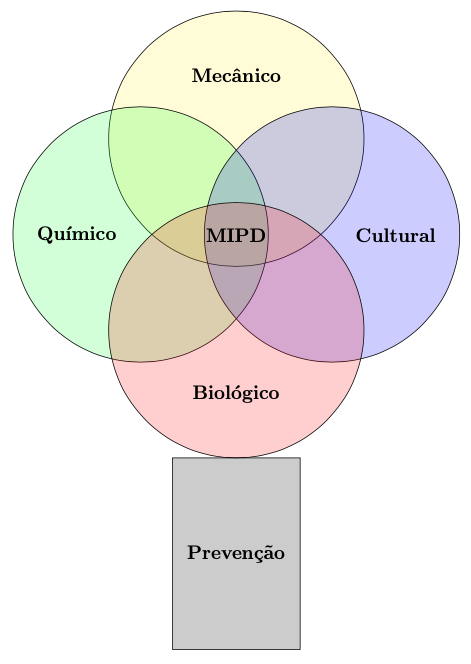
```
]


---

# Manejo Integrado de Plantas Daninhas


## Três princípios:

- Abaixar a densidade de equilíbrio para um nível tolerável
--


- Reduzir a adequação relativa (e efeito) da planta daninha (aumenta a tolerância)
--


- Mudar a composição das comunidades de plantas daninhas para plantas menos agressivas e fáceis de manejar
--


```{r echo=FALSE, out.width=700, fig.align='center'}
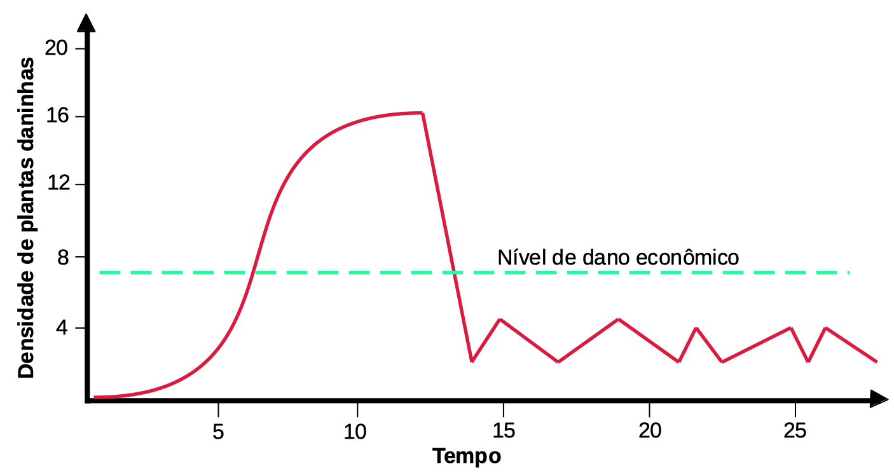
```


---

# Conhecer a planta daninha

## Classificação de plantas daninhas

- **História da vida** - ciclo de vida, estação do crescimento, época e método de reprodução (por exemplo: verão / inverno anual, bianunal, perene)

```{r echo=FALSE, out.width=900, fig.align='center'}
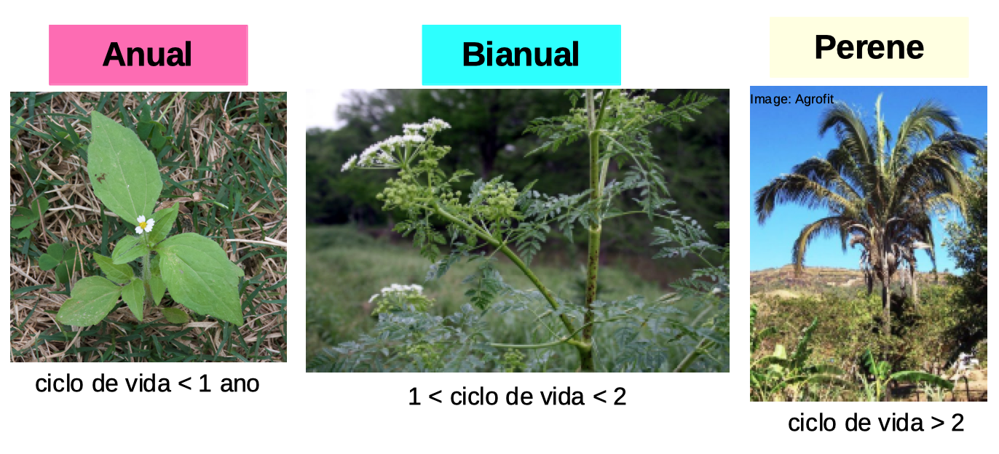
```


---

# Conhecer a planta daninha

## Classificação de plantas daninhas


- **Classificação por estratégia evolutiva** 

```{r echo=FALSE, out.width=900, fig.align='center'}
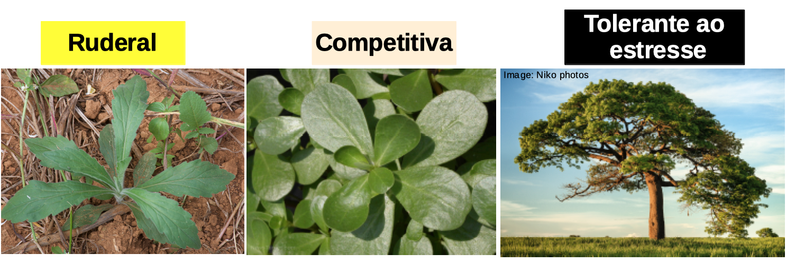
```


---

# Prevenção


**Quarentena**  são usadas para isolar e previnir a propagação de plantas nocivas
  

  
> **Fato:** "Cerca de 85% das plantas que chegam ao País para fins de pesquisa estão contaminadas com pragas" (EMBRAPA)

```{r echo=FALSE, out.width=500, fig.align='center'}
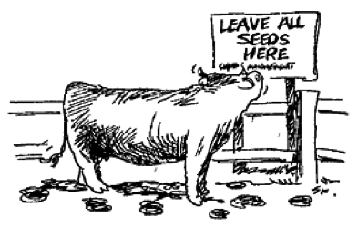
```


---


# Prevenção


**Lei de sementes**  são decretadas para garantir a pureza de sementes de culturas de alto valor econômico e prevenir a dispersão de sementes de plantas daninhas

```{r echo=FALSE, out.width=500, fig.align='center'}
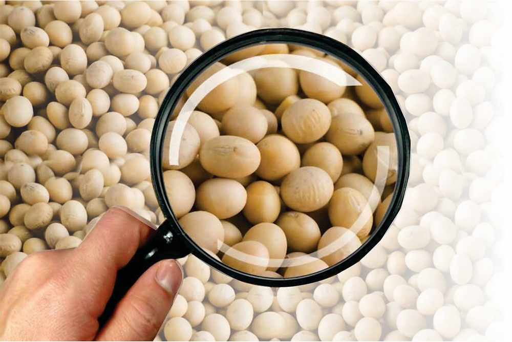
``` 


Acesse aqui a [Lei de sementes no Brasil](http://www.planalto.gov.br/ccivil_03/LEIS/2003/L10.711.htm)


---

# Prevenção


**Educação** para prevenir a propagação de plantas daninhas requer que individuos sejam capazes de identificar espécies de plantas daninhas/invasoras.


```{r echo=FALSE, out.width=700, fig.align='center'}
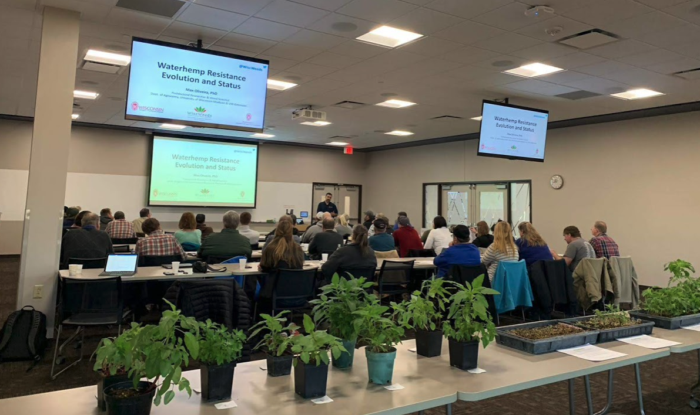
``` 

---

# Prevenção

## Precauções além de leis e regulações

- Não deixe plantas indesejáveis reproduzirem
--


- Não espalhe sementes em áreas não infestadas
--


- Não espalhe estruturas reprodutivas de plantas daninhas ou invasoras
--


- Não alimente animais com material contaminado com sementes ou propagulos de plantas daninhas/invasoras
--


- Limpeza de equipamentos, máquinas, colheitadoras, implementos etc
--


- Elimine plantas daninhas antes da fase reprodutiva


---

# Prevenção

.pull-left[
```{r echo=FALSE, out.width=700, fig.align='center'}
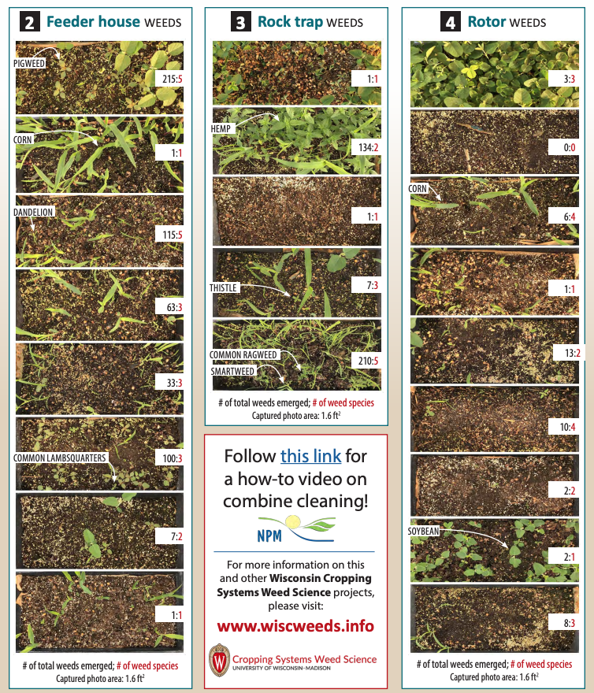
``` 
]

.pull-right[
```{r echo=FALSE, out.width=700, fig.align='center'}
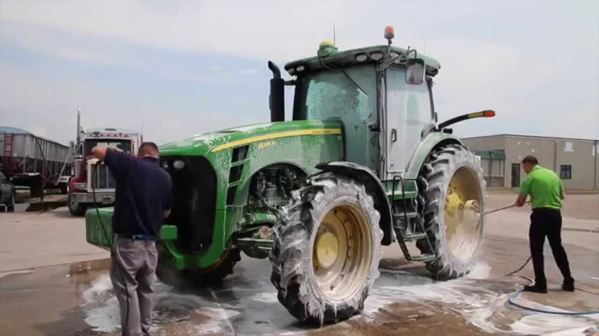
``` 
]

---

# Controle biológico

- Proposta da Embrapa Koller & Nunes (2006) para o controle de ciganinha (*Memora peregrina*)


.pull-left[
```{r echo=FALSE, out.width=270, fig.align='center'}
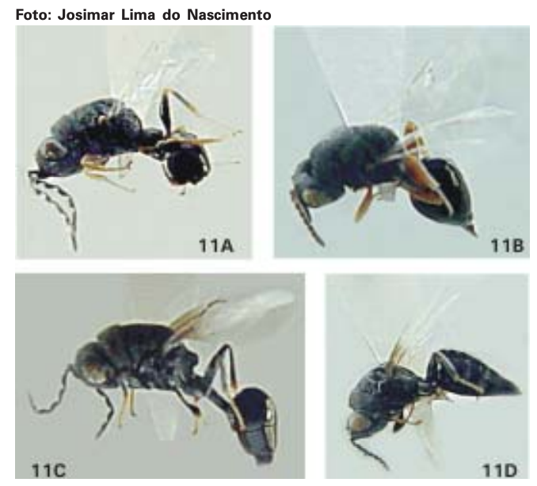
``` 

```{r echo=FALSE, out.width=400, fig.align='center'}
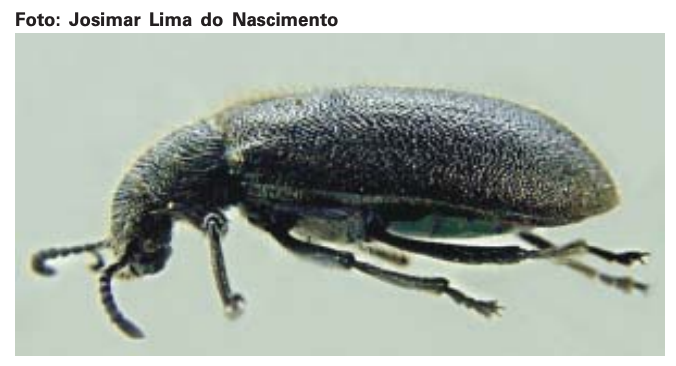
``` 
]

.pull-right[
```{r echo=FALSE, out.width=330, fig.align='center'}
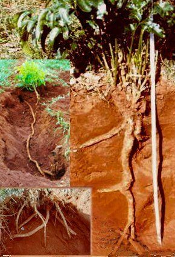
``` 
]


---

# Controle mecânico


```{r echo=FALSE, out.width=700, fig.align='center'}
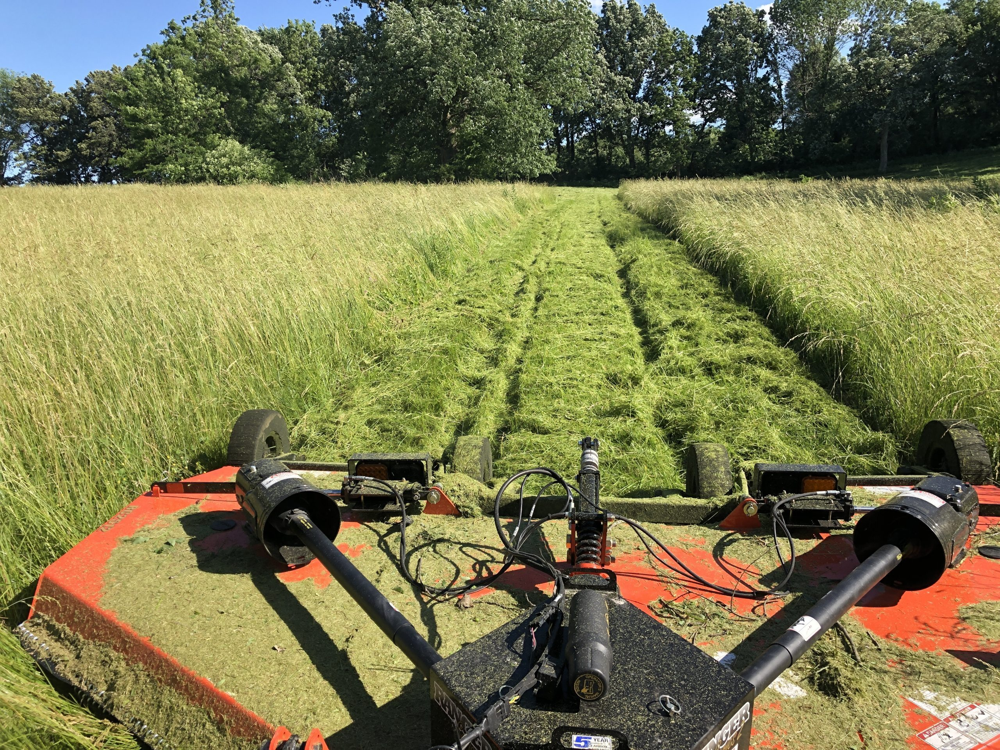
``` 
Imagem: i1.wp.com


---

# Controle mecânico

- Controle de plantas daninhas arbustivas

- Necessário na integração com herbicidas


.pull-left[
```{r echo=FALSE, out.width=700, fig.align='center'}
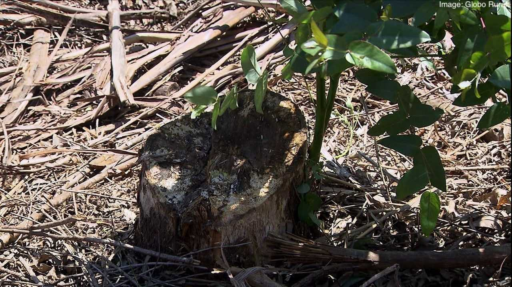
``` 
]

.pull-right[
```{r echo=FALSE, out.width=700, fig.align='center'}
knitr::include_graphics("https://media.giphy.com/media/VNdgEiEcRalhe/giphy.gif")
``` 
]


---

# Controle cultural

.pull-left[
- Sementes sadias

- Integração lavoura pecuária

- Sistemas agroflorestais
]

.pull-right[
- Quantidade de sementes/ha

- Rotação/sucessão de culturas

- Plantas competitivas
]

```{r echo=FALSE, out.width=800, fig.align='center'}
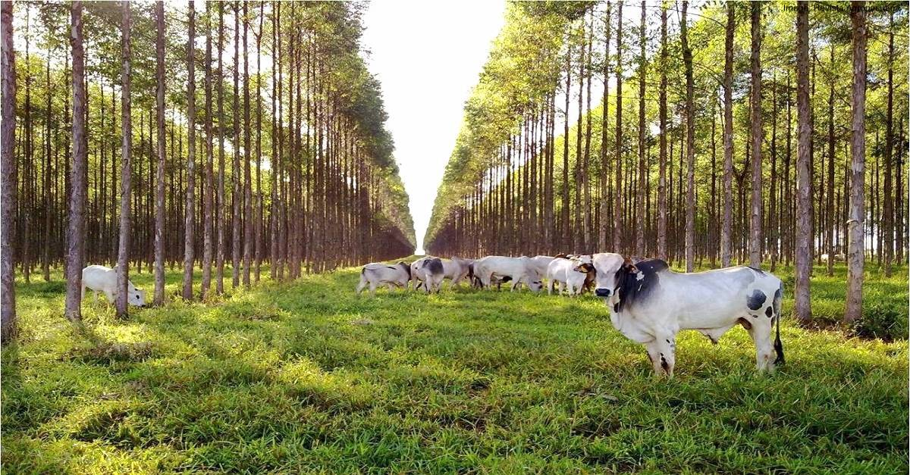
```


---

# Sistemas ILP


```{r echo=FALSE, out.width=500, fig.align='center'}
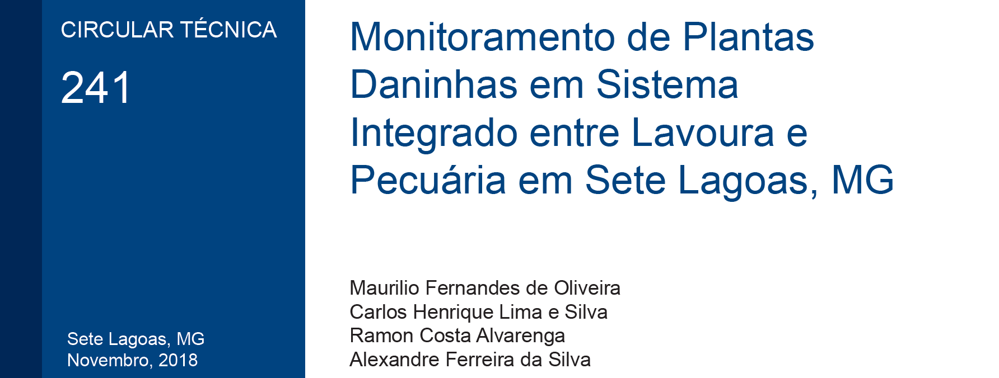
```

.pull-left[
```{r echo=FALSE, out.width=800, fig.align='center'}
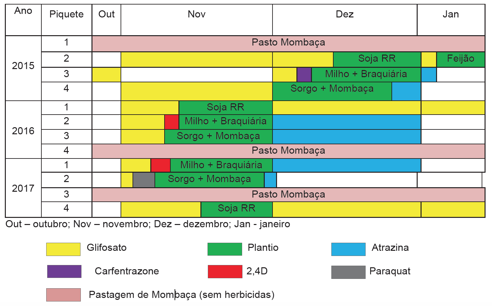
```
]


.pull-right[
```{r echo=FALSE, out.width=800, fig.align='center'}
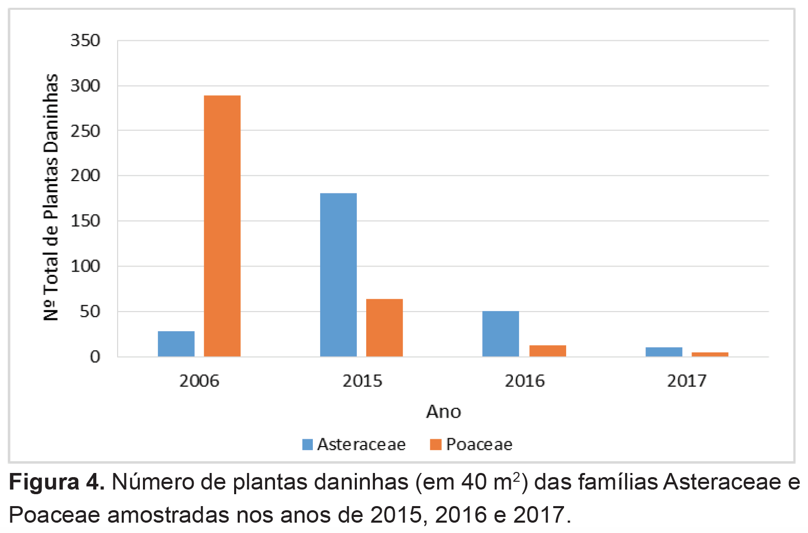
```
]

---

# Sistemas ILP

- Principio do MIPD

    - Mudar a composição das comunidades de plantas daninhas para plantas menos agressivas e fáceis de manejar


```{r echo=FALSE, out.width=600, fig.align='center'}
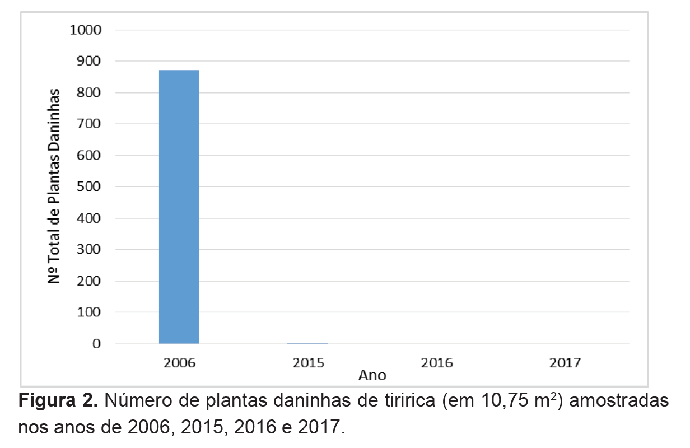
```


---

# Controle químico


```{r echo=FALSE, out.width=800, fig.align='center'}
knitr::include_graphics("https://topsul1.webnode.com/_files/200010668-c3abbc4a56/TopSul%20Not%C3%ADcias%20-%20Crissiumal%20-%20RS%20-%20www.topsulnoticias.com.br%20-%20%20herbicida.jpg")
```
Imagem: topsul1.webnode.com


---


# Controle químico

## Alguns conceitos básicos

- Sistêmico vs Contato

```{r echo=FALSE, out.width=700, fig.align='center'}
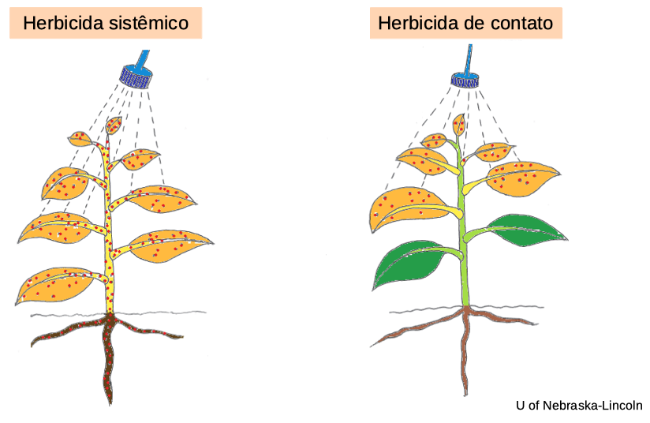
```


---

# Controle químico

## Alguns conceitos básicos

- Seletivo vs Não-seletivo


.pull-left[
```{r echo=FALSE, out.width=700, fig.align='center'}
knitr::include_graphics("images/selective.jpg")
```
]


.pull-right[
```{r echo=FALSE, out.width=700, fig.align='center'}
knitr::include_graphics("images/nonselective.jpg")
```
]

---


# Classificação dos Herbicidas no Brasil

- Mecanismos de ação (Folha 1) - https://maxweeds.rbind.io/post/chart/Chart_Herbicida.pdf

```{r echo=FALSE, out.width=850, fig.align='center'}
knitr::include_graphics("https://maxweeds.rbind.io/post/chart/first.png")
```


---

# Classificação dos Herbicidas no Brasil

- Combinação de herbicidas (Folha 2)

```{r echo=FALSE, out.width=700, fig.align='center'}
knitr::include_graphics("https://maxweeds.rbind.io/post/chart/second.png")
```


---

# Controle químico no Brasil


```{r echo=FALSE, out.width=600, fig.align='center'}
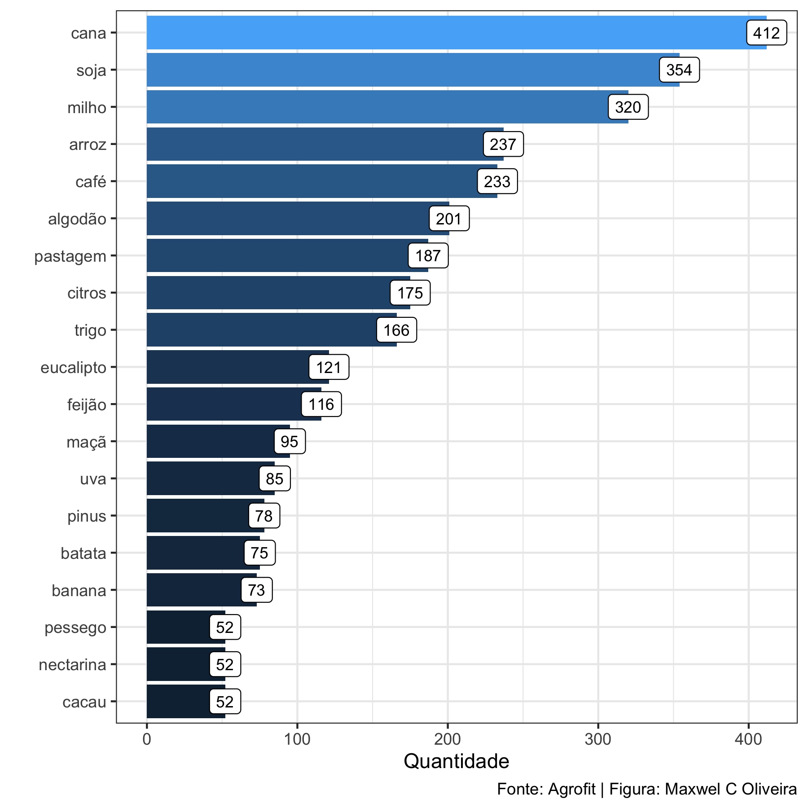
```


---

# Herbicidas registrados para pastagens

- Contendo 1 ingrediente ativo

| Grupo | Ingrediente ativo    | Quantidade | Produto comercial 
|-------------------|----------------------|:------------:|-----------------|      
| G                 | glifosato            | 67         | Nufosate e outros |
| O                 | 2,4-D                | 39         | DMA 806 BR e outros |
| O                 | picloram             | 15         | Danado e outros       |
| O                 | triclopir-butolitico | 10         | Garlon e outros    |
| B                 | metsulfurom-metilico | 6          | Ally e outros       |
| C1,2              | tebutiurom           | 2          | Lava 100, Graslan 100            |
| O                 | fluroxipir-meptilico | 1          | Starane 200         |
| E                 | carfentrazona-etílica| 1          | Spotlight           |
| E                 | saflufenacil         | 1          | Heat                |
| B                 | imazetapir           | 1          | Imazetapir 106 BR   |
Fonte: Agrofit Mapa


---

# Herbicidas registrados para pastagens

- Contendo 2 ou 3 ingredientes ativos

| Grupo | Ingrediente ativo      | Quantidade | Produto comercial                  |
|-------------------|---------------------------|:------------:|-----------------------------|
| O + O   | 2,4-D + picloram     | 31         |  Jacaré e outros    |
| O + O   | fluroxipir-meptilico + picloram    |  10        | Arreio e outros    |
| O + O   | 2,4-D + aminopiralide   |   9        | Tordon XT e outros         |
| O + O + O  | aminopiralide + picloram + triclopir-butotilico |  3    | Dominum XT, Trueno XT, Planador XT |
| O + O + O  | aminopiralide + fluroxipir-meptilico + picloram |  3 | DominumXT-S, PlanadorXT-S, TruenoXT-S    |
| O + O  | aminopiralide + fluroxipir-meptilico        |    2       | Dominum, Trueno    |
| O + O  | fluroxipir-meptilico + triclopir-butotilico |    2       | Truper          |
| O + B  | aminopiralide + metsulfurom-metilico        |    1       | Chaparral          |
| B + B  | imazapique + imazapir                       |    1       | Kifix              |
| O + O  | picloram + triclopir-butotilico             |   1        | Togar TB            |
Fonte: Agrofit Mapa

---


# Herbicidas para pastagens

```{r echo=FALSE, out.width=1000, fig.align='center'}
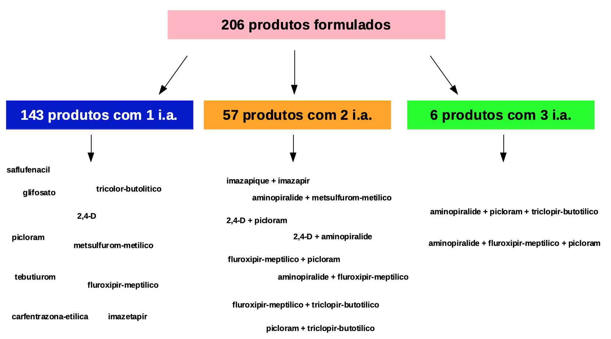
```


---

# Plantas daninhas 

- Plantas controladas com os herbicidas registrados para pastagens

- 108 espécies (89 dicot e 19 monocot)

```{r echo=FALSE, out.width=800, fig.align='center'}
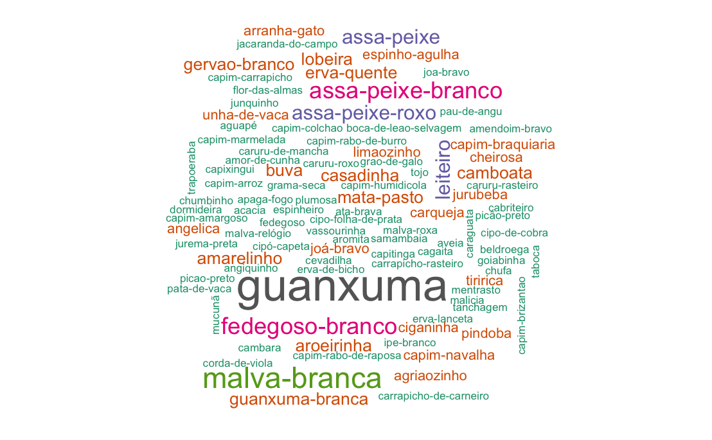
```

---


```{r echo=FALSE, out.width=600, fig.align='center'}
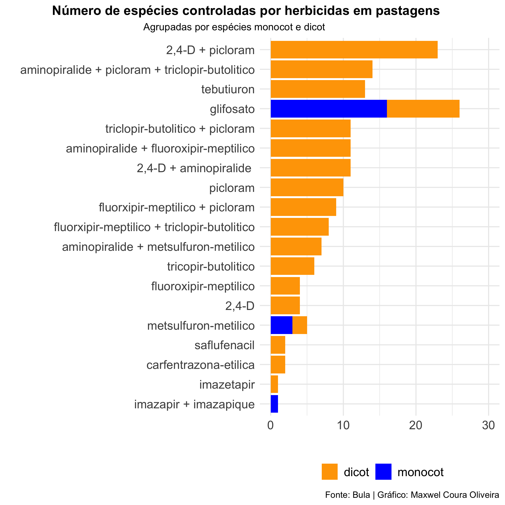
```


---


```{r echo=FALSE, out.width=600, fig.align='center'}
knitr::include_graphics("images/MdA.png")
```

---

class: inverse, center, middle

# Grupo G (Inibidores da EPSPS)

glifosato

```{r echo=FALSE, out.width=600, fig.align='center'}
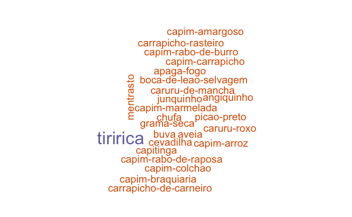
```

---

# Grupo G (Inibidores da EPSPS)

- Herbicida sistemico

- Não-seletivo

```{r echo=FALSE, out.width=600, fig.align='center'}
knitr::include_graphics("images/gly_drybean.jpg")
```


---


# Grupo G (Inibidores da EPSPS)

## Glifosate (Várias formulações)

.pull-left[
- Herbicida não-seletivo

- Dessecação/Renovação de pastagens

- Aplicação foliar dirigida

- Dose (0,5 a 2,5 kg ae ha<sup>-1</sup>)

- Amplo espectro de controle
]


.pull-right[

- Aplicação dirigida

```{r echo=FALSE, out.width=500, fig.align='center'}
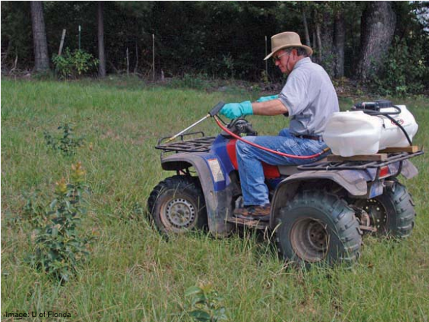
```

]


---

class: inverse, center, middle

# Grupo C1,2 (Inibidores da Fotossíntese no FSII)

tebutiuron

```{r echo=FALSE, out.width=600, fig.align='center'}
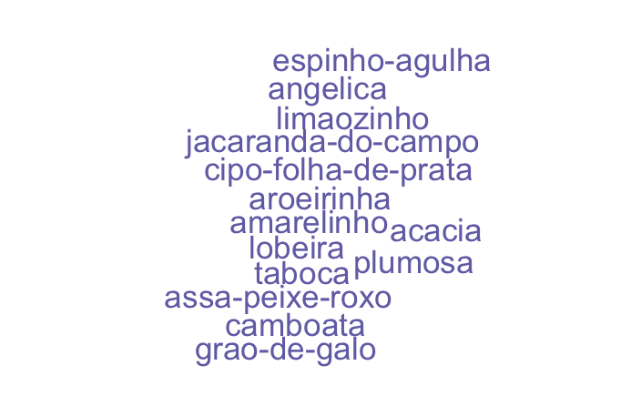
```


---


# Grupo C1,2 (Inibidores da Fotossíntese no FSII)

- Herbicida sistêmico (via xilema)

```{r echo=FALSE, out.width=600, fig.align='center'}
knitr::include_graphics("images/simazine_SB.jpg")
```


---

# Grupo C1,2 (Inibidores da Fotossíntese no FSII)

.pull-left[
- tebutiuron (Graslan 100)

- Controle de espécies arbustivas

- Dose: 20 a 80 g pc ha<sup>-1</sup>

- Produto peletizado


- Lobeira (*Solanum lycocarpum*)
```{r echo=FALSE, out.width=600, fig.align='center'}
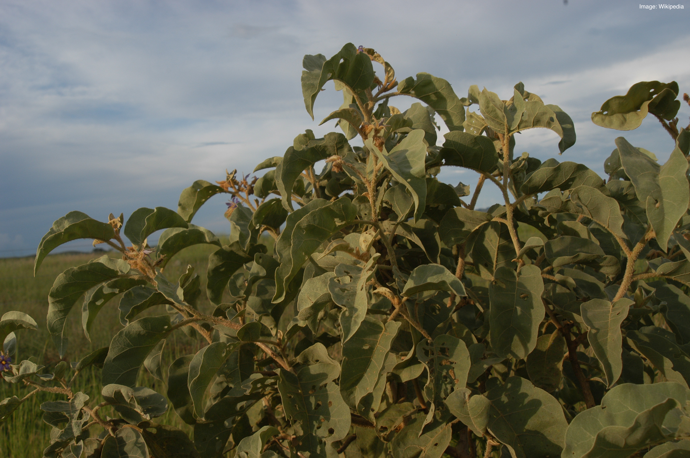
```
]


.pull-right[
- Jacarandá do campo (*Machaerium acutifolium*)
```{r echo=FALSE, out.width=800, fig.align='center'}
knitr::include_graphics("images/jaca_do_campo.jpeg")
```
]


---

## Tebutiuron

- Aplicação: Distribuindo-se o produto uniformemente ao redor da planta em calda ou em peletes

.pull-left[
```{r echo=FALSE, out.width=350, fig.align='center'}
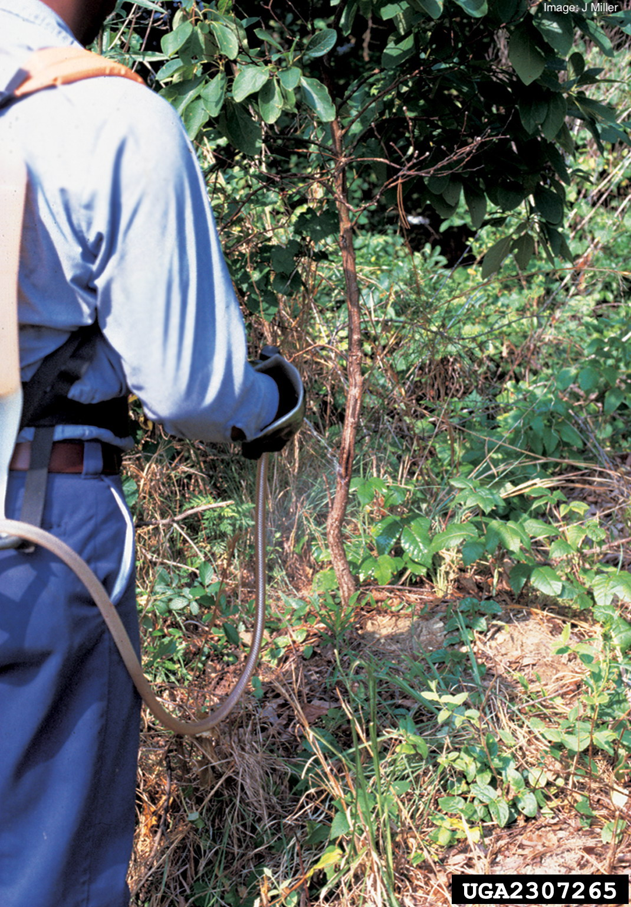
```
]

.pull-right[
```{r echo=FALSE, out.width=450, fig.align='center'}
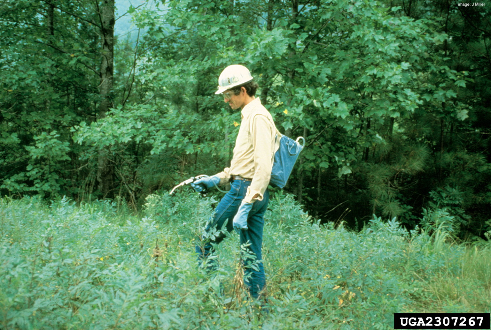
```

- Absorção pelas raízes
]

---

## Tebutiuron

- amarelinho (*Tecoma stans*)

.pull-left[
Passini et al. (1997)
```{r echo=FALSE, out.width=600, fig.align='center'}
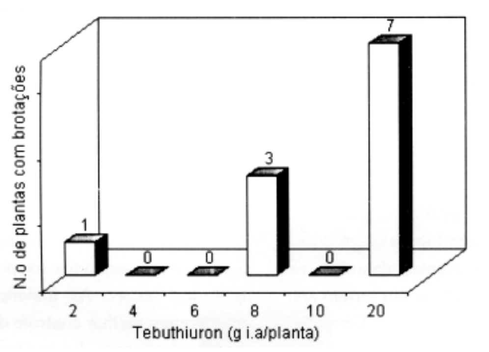
```
]

.pull-right[
```{r echo=FALSE, out.width=600, fig.align='center'}
knitr::include_graphics("images/tecoma.jpg")
```
]

- A menor dose de tebutiuron foi suficiente para matar as plantas
num período de nove meses após a aplicação do herbicida

---

class: inverse, center, middle

# Grupo B (Inibidores da ALS)

imazapique + imazapir, imazetapir

```{r echo=FALSE, out.width=600, fig.align='center'}
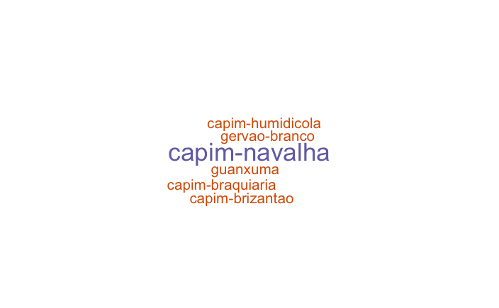
```

---

# Grupo B (Inibidores da ALS)

- Herbicidas sistêmicos

- Clorose, folhas roxas, retarda o crescimento, inibe raízes

.pull-left[
```{r echo=FALSE, out.width=300, fig.align='center'}
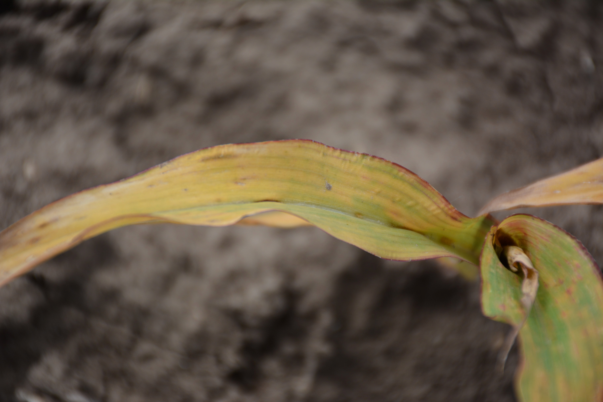
```

```{r echo=FALSE, out.width=300, fig.align='center'}
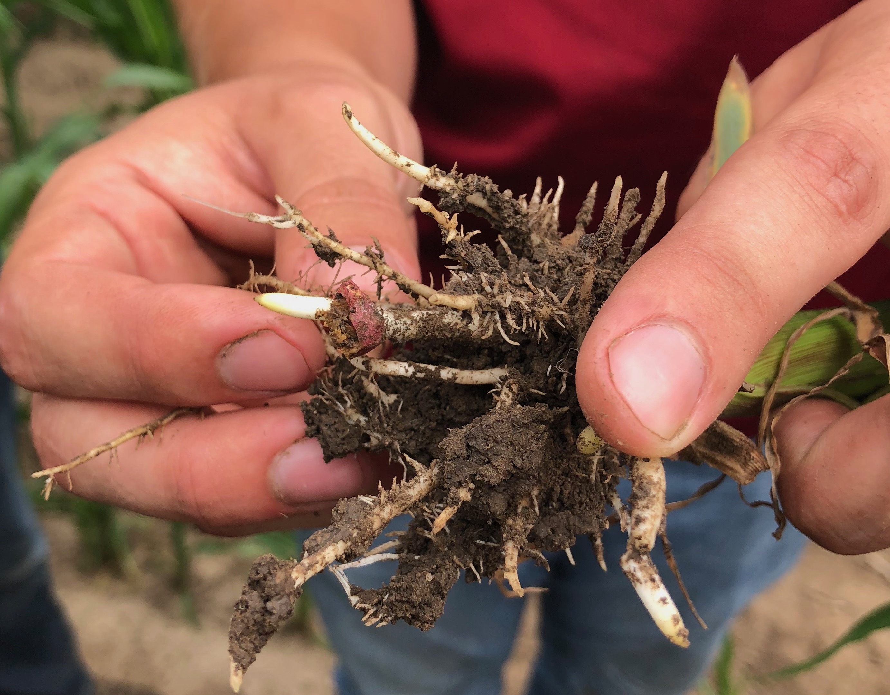
```
]


.pull-right[
```{r echo=FALSE, out.width=300, fig.align='center'}
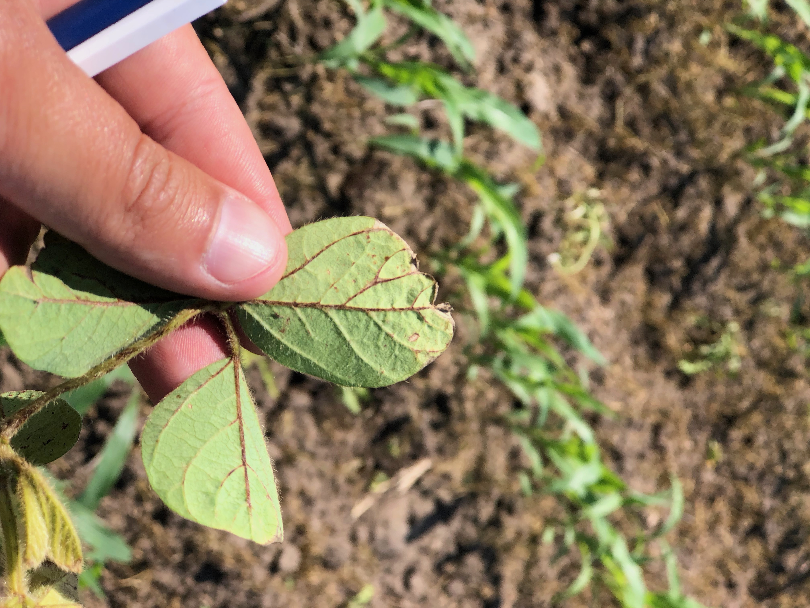
```

```{r echo=FALSE, out.width=300, fig.align='center'}
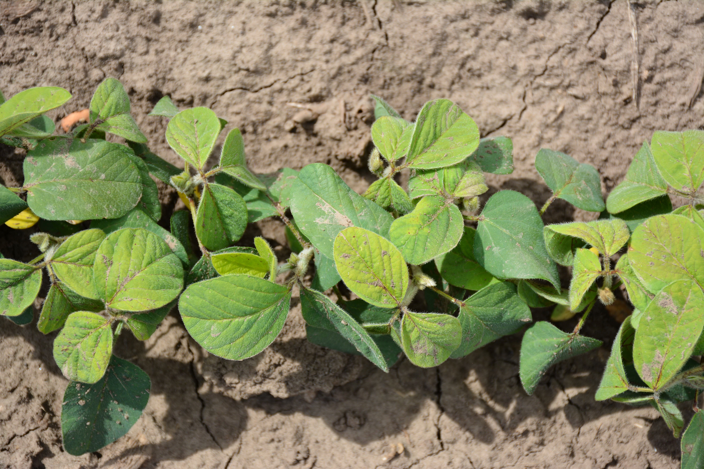
```
]

---

# Grupo B (Inibidores da ALS)

.pull-left[
- **imazapique + imazapir** (Kifix<sup>®</sup> - 300 a 400 mL pc ha<sup>-1</sup>)

- PÓS com pastagem formada (> 1 ano)

- Pode ser observado clorose até 90 dias

```{r echo=FALSE, out.width=350, fig.align='center'}
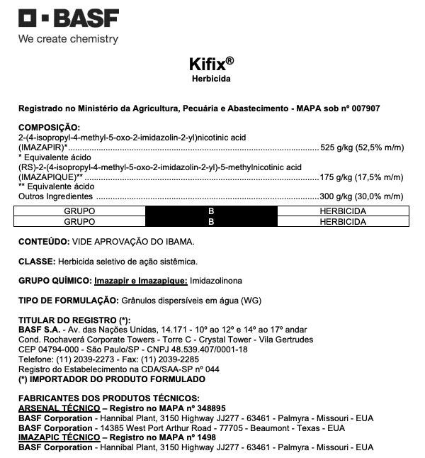
```
]


.pull-right[

- **imazetapir** (Imazetapir 106 BR - 3 a 6 L pc ha<sup>-1</sup>)

- Uso de adjuvantes

- Controle de capim-navalha (*Paspalum urvillei*)
```{r echo=FALSE, out.width=500, fig.align='center'}
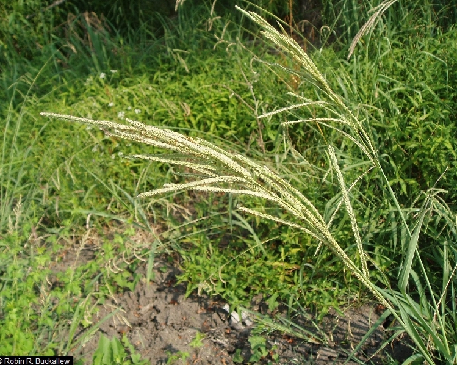
```
]


---

# Grupo B (Inibidores da ALS)


- **metsulfurom-metilico** (Ally<sup>®</sup> - 6,6 a 13,3 g pc ha<sup>-1</sup> + OM)

- Pré e pós-emergência

- Aplicação em área total ou localizada

> Controla pastagens desejáveis


.pull-left[
- Gervão branco (*Croton glandulosus*)
```{r echo=FALSE, out.width=250, fig.align='center'}
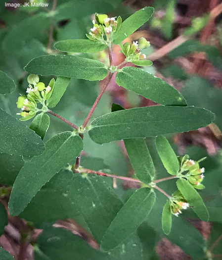
```
]

.pull.right[
- Guanxuma (*Sida* spp.)
```{r echo=FALSE, out.width=350, fig.align='center'}
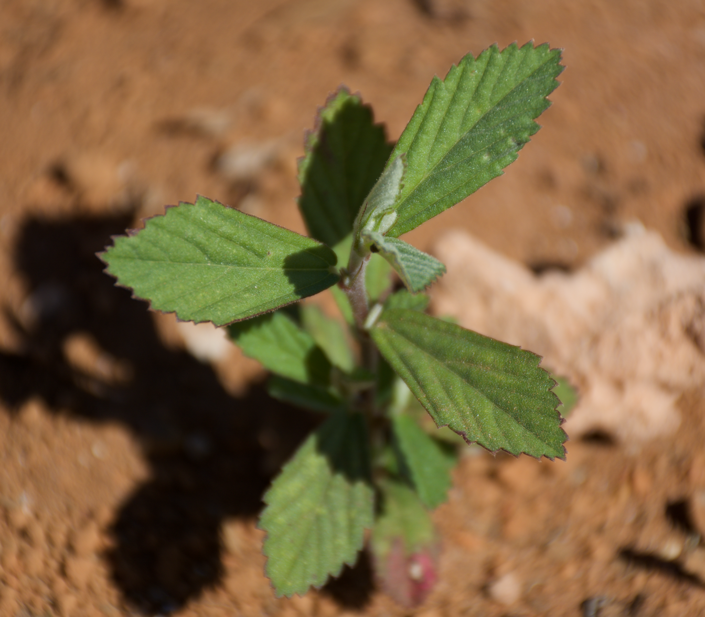
```
]

---

class: inverse, center, middle

# Grupo E (Inibidores da PPO/PROTOX)

carfentrazona-etílica, saflufenacil

```{r echo=FALSE, out.width=600, fig.align='center'}
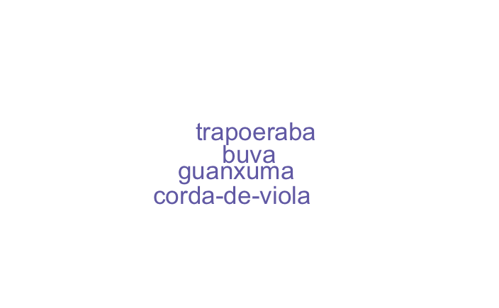
```

---

# Grupo E (Inibidores da PPO/PROTOX)

- Herbicidas de contato (foliar)

- Queimam a folha

- Absorvidos pelas raízes

.pull-left[
```{r echo=FALSE, out.width=600, fig.align='center'}
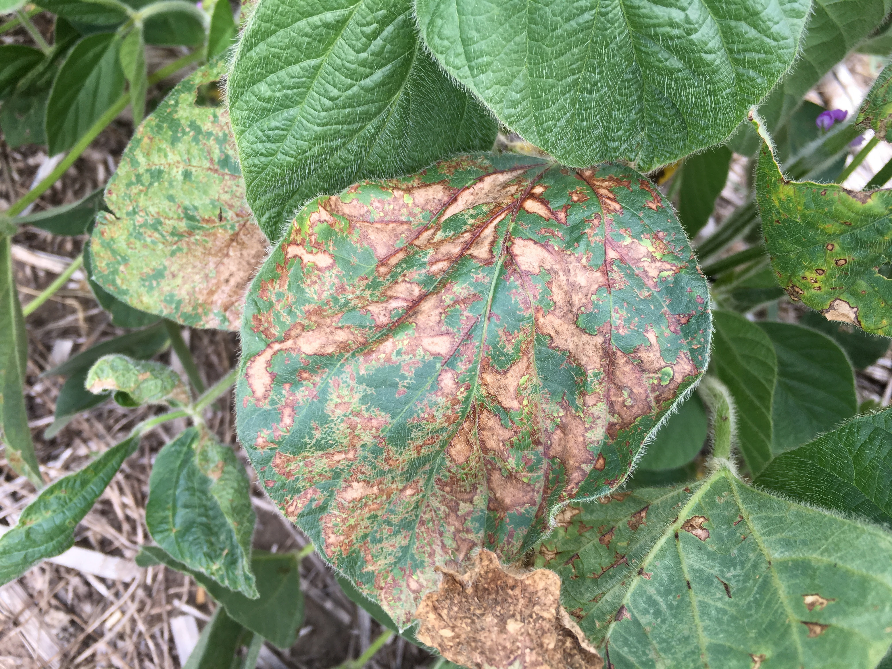
```
]

.pull-right[
```{r echo=FALSE, out.width=600, fig.align='center'}
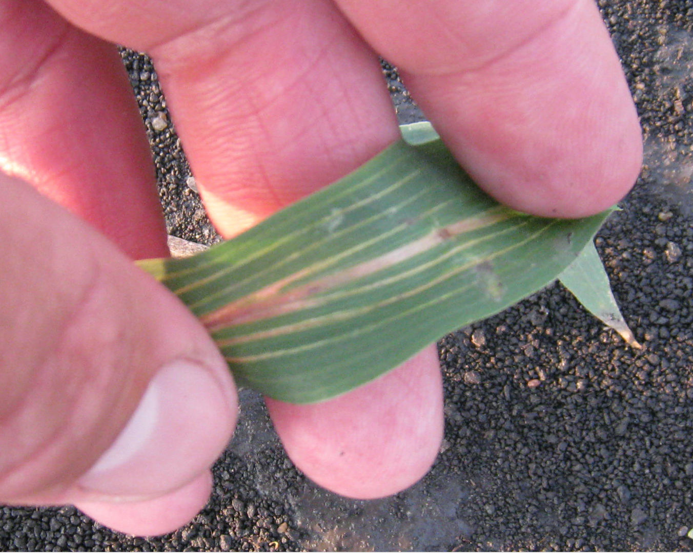
```
]

---


# Grupo E (Inibidores da PPO/PROTOX)

- **carfentrazona-etílica** (Spotlight<sup>®</sup> 75 a 125 mL pc ha<sup>-1</sup>)

.pull-left[

- Aplicação foliar em área total

- Herbicida de contato / cobertura

- PÓS-emergência

- Reforma: 30 a 60 dias após o plantio

> Aplicar em epóca de época de intenso crescimento das plantas daninhas

```{r echo=FALSE, out.width=400, fig.align='center'}
knitr::include_graphics("images/spotlight.png")
```

]


.pull-right[
- corda de viola (*Ipomoea* spp)
```{r echo=FALSE, out.width=250, fig.align='center'}
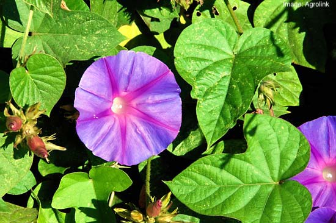
```


- trapoeraba (*Commelina* spp.)
```{r echo=FALSE, out.width=250, fig.align='center'}
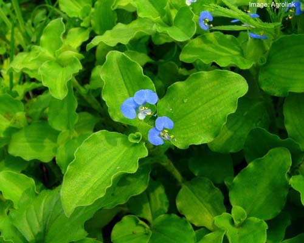
```
]


---

# Grupo E (Inibidores da PPO/PROTOX)


- **saflufenacil** (Heat<sup>®</sup> 70-100 g pc ha<sup>-1</sup>)

.pull-left[

> *Brachiaria brizantha*, *Brachiaria decumbens* e *Panicum maximum* cv. Tobiatã.

- Aplicação foliar em área total

- Pós-emergência

- Planta daninha (2 a 8 folhas)

```{r echo=FALSE, out.width=400, fig.align='center'}
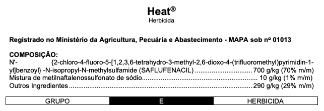
```

]


.pull-right[
- Guanxuma (*Sida* spp.)
```{r echo=FALSE, out.width=250, fig.align='center'}

```


- buva (*Conyza* spp.)
```{r echo=FALSE, out.width=250, fig.align='center'}
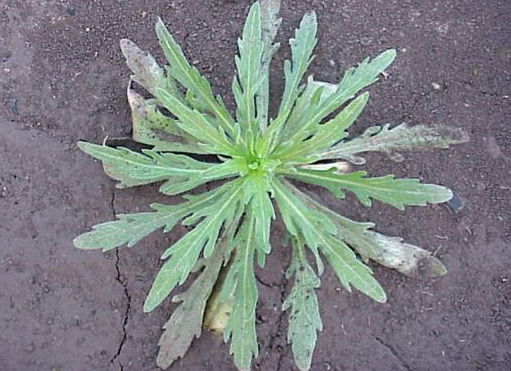
```
]

---

## Saflufenacil (Heat)

- Seletivo para gramíneas

```{r echo=FALSE, out.width=700, fig.align='center'}
knitr::include_graphics("images/sharpen.jpg")
```


---

class: inverse, center, middle

# Grupo O (Mimetizadores da auxina)

aminopiralide, picloram, fluroxipir-meptílico, triclopir-butotílico, 2,4-D

```{r echo=FALSE, out.width=600, fig.align='center'}
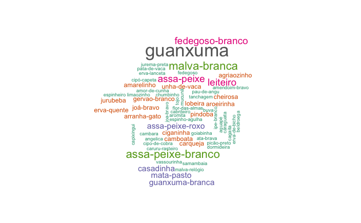
```

---

# Grupo O (Mimetizadores da auxina)

- Herbicida sistêmico

- Seletivo para gramíneas

```{r echo=FALSE, out.width=600, fig.align='center'}
knitr::include_graphics("images/auxin.jpg")
```


---

# Grupo O (Mimetizadores da auxina)


.pull-left[
```{r echo=FALSE, out.width=400, fig.align='center'}
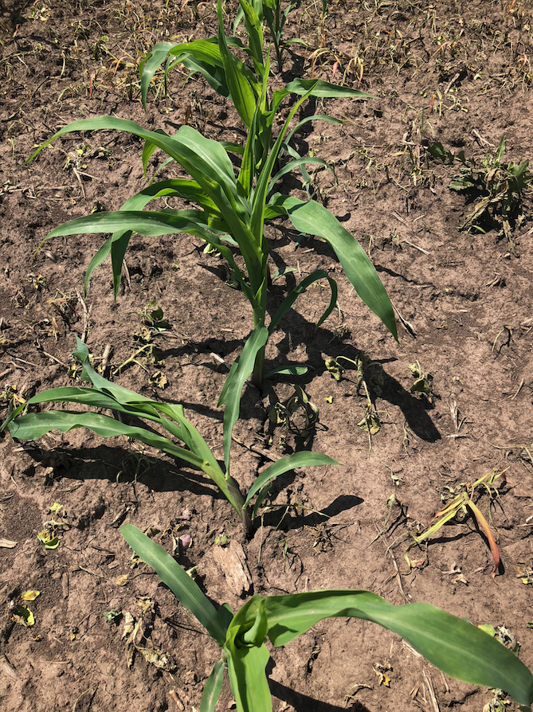
```
]

.pull-right[
```{r echo=FALSE, out.width=600, fig.align='center'}
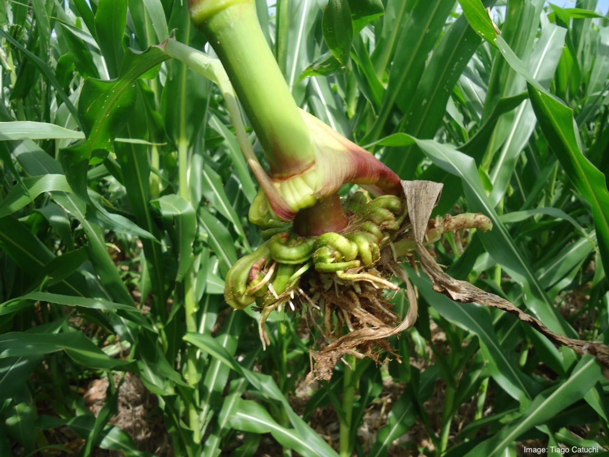
```
]

---

# Grupo O (Mimetizadores da auxina)

| Grupo | Família química            | Ingrediente ativo    |
|-------|----------------------------|----------------------|
|       | Carboxilatos de piridina   | aminopiralide        |
|       |                            | picloram             |
| O     | Carboxilatos de piridiloxi | fluroxipir-meptílico |
|       |                            | triclopir-butotílico |
|       | Carboxilatos de fenoxi     | 2,4-D                |


- Herbicidas que controlam apenas plantas de folhas largas (dicot)

.pull-left[
```{r echo=FALSE, out.width=500, fig.align='center'}
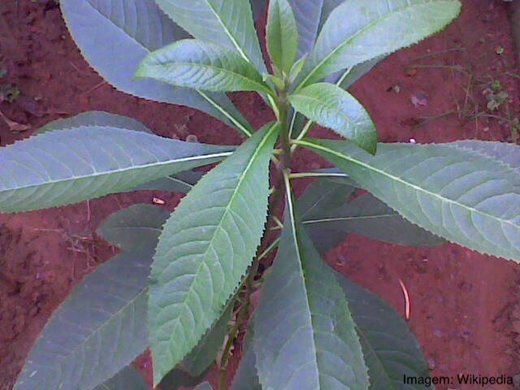
```
]

.pull-right[
```{r echo=FALSE, out.width=500, fig.align='center'}
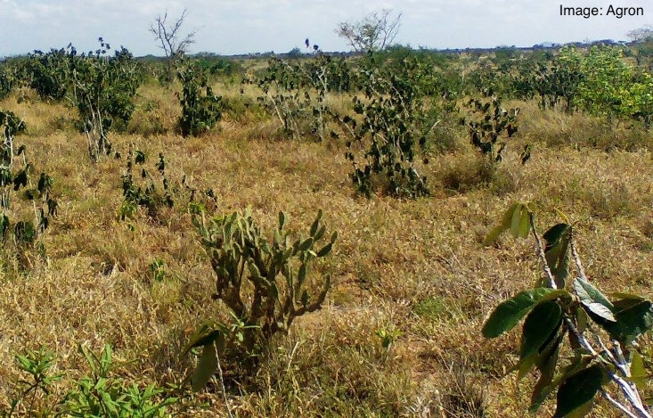
```
]


---

# Grupo 0 (Mimetizadores da auxina)


- **picloram** (Danado<sup>®</sup> - 1 a 2 L pc ha<sup>-1</sup> em 100 L)

- Controle de plantas daninhas de folha larga de porte arbóreo, arbustivo e sub-arbustivo

- Corte e aplicação no toco

- Trate a circunferência de caules e todo o topo de pequenos caules


.pull-left[
```{r echo=FALSE, out.width=500, fig.align='center'}
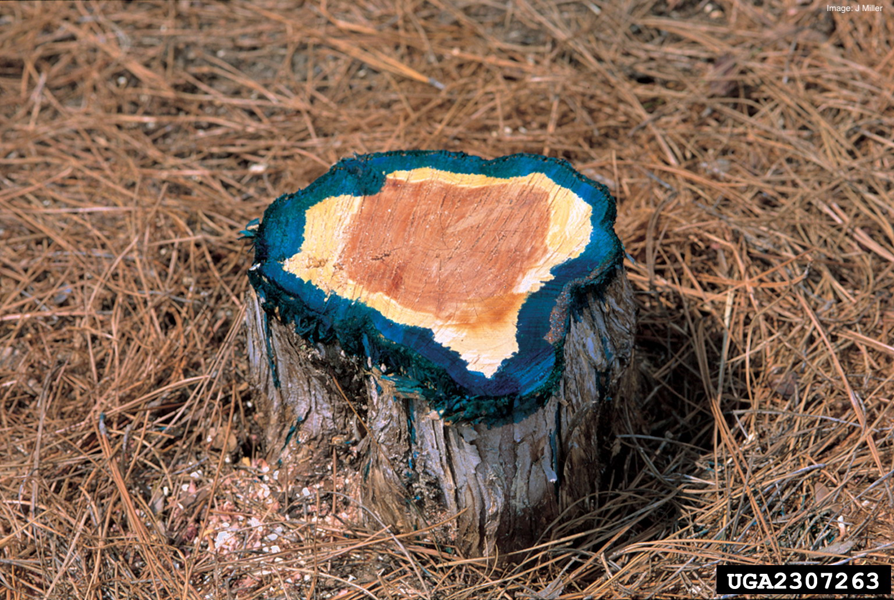
```
]

.pull-right[
```{r echo=FALSE, out.width=500, fig.align='center'}
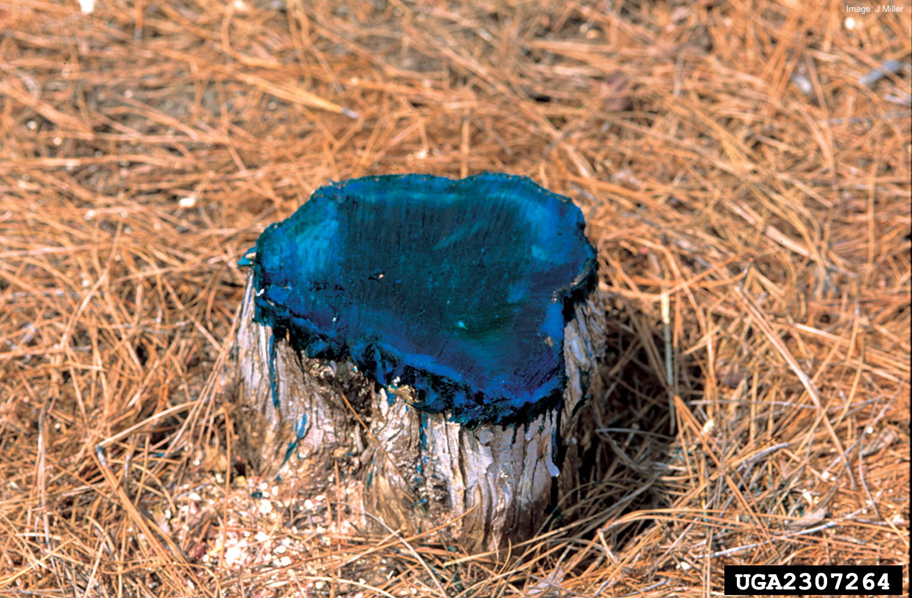
```
]


---

## Métodos de aplicação de hebicidas no tronco


.pull-left[
```{r echo=FALSE, out.width=350, fig.align='center'}
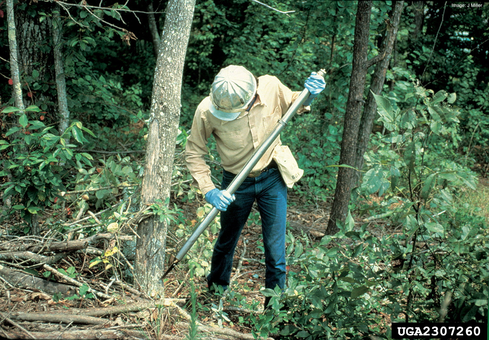
```

```{r echo=FALSE, out.width=350, fig.align='center'}
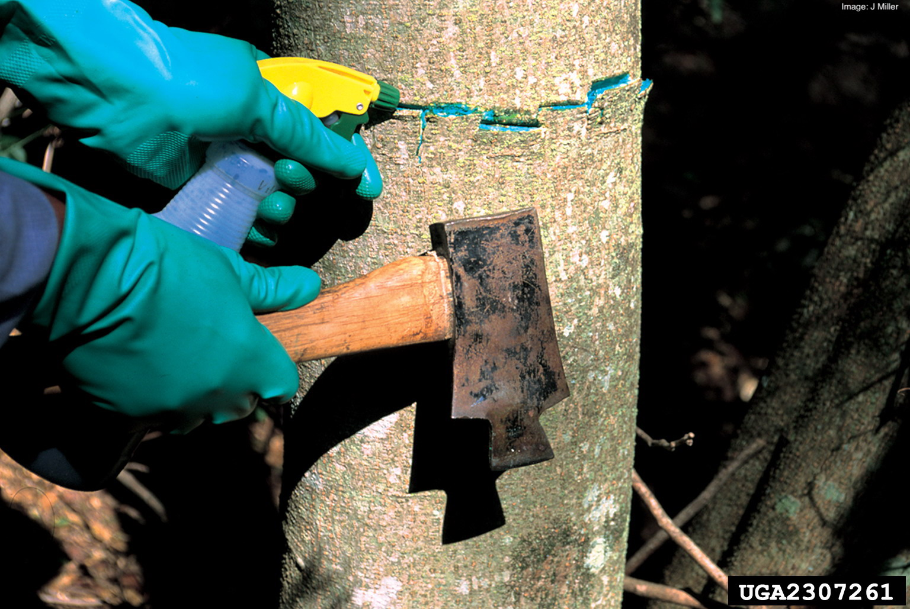
```
]

.pull-right[
```{r echo=FALSE, out.width=300, fig.align='center'}
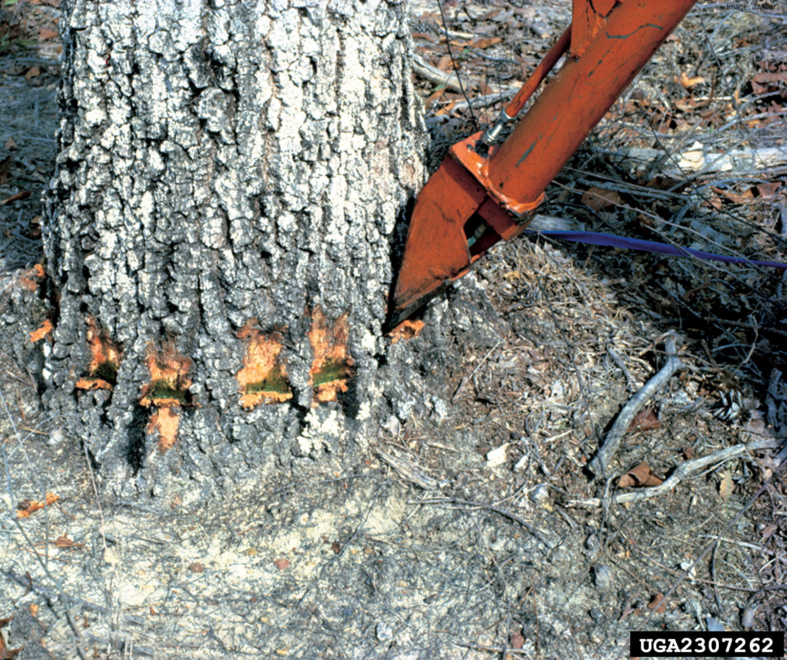
```

```{r echo=FALSE, out.width=350, fig.align='center'}
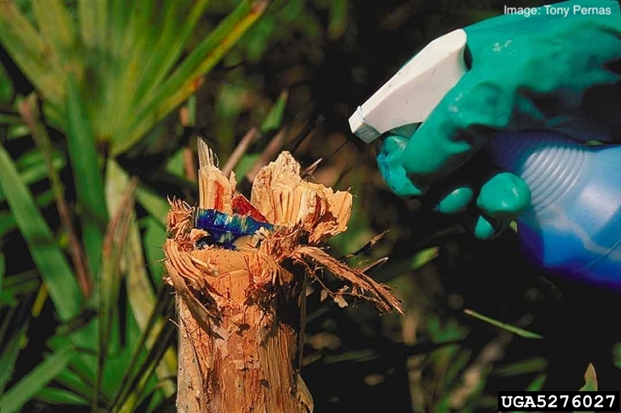
```
]


---

# Grupo 0 (Mimetizadores da auxina)


.pull-left[
- **triclopir-butotilico** (Garlon<sup>®</sup> 480 BR - 0,4 a 2 L pc ha<sup>-1</sup>)

    - Controle em área total ou basal dirigida

- **picloram + triclopir-butotilico** (Tolgar TB - 6 a 8% (v/v) - 150 L)

    - Específico para aplicação basal dirigida
    
```{r echo=FALSE, out.width=300, fig.align='center'}
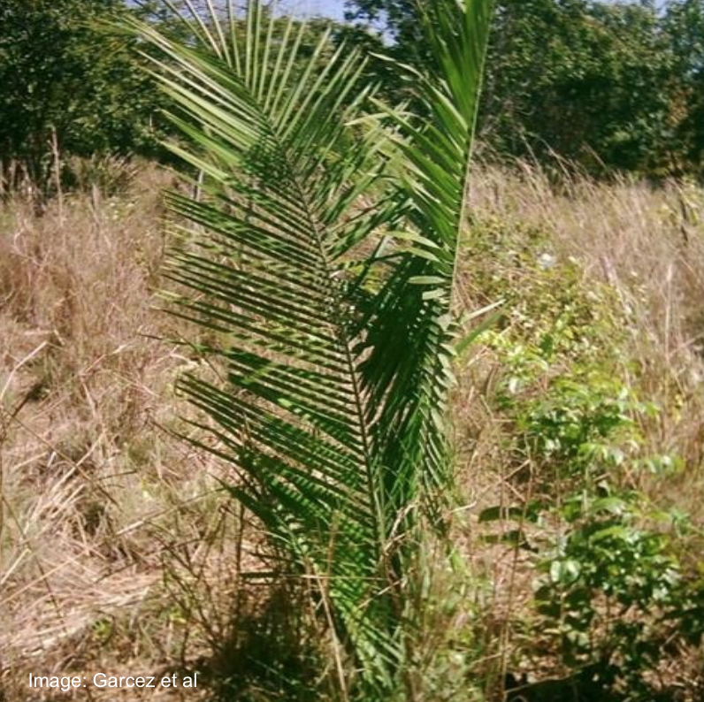
```   
   
    
]

.pull-right[
- Mistura com óleo diesel em aplicação dirigida

```{r echo=FALSE, out.width=500, fig.align='center'}
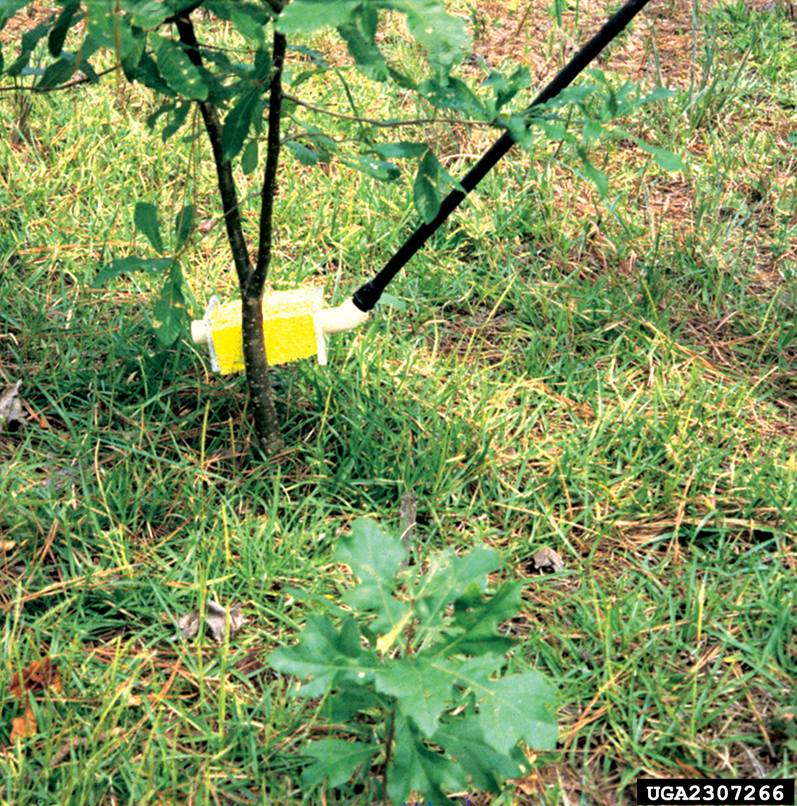
```
]


---

# Controle

```{r echo=FALSE, out.width=400, fig.align='center'}
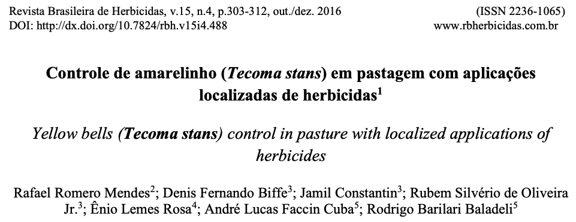
```

```{r echo=FALSE, out.width=900, fig.align='center'}
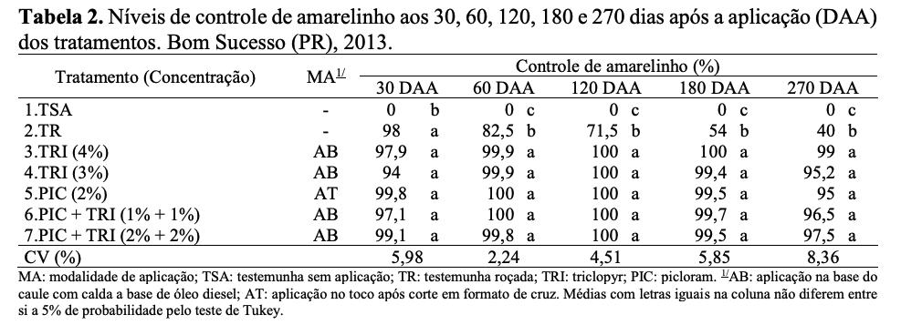
```


---

# Grupo 0 (Mimetizadores da auxina)

- **aminopiralide + picloram + triclopir-butotilico** (XT<sup>®</sup> - 0,5 a 5 L pc ha<sup>-1</sup>)

- **aminopiralide + fluroxipir-meptilico + triclopir-butotilico** (XT-S<sup>®</sup>)

- 3 mecanismos de ação

- Controle de plantas daninhas de folha larga de porte arbóreo, arbustivo e sub-arbustivo

- Pós-emergente de plantas daninhas

```{r echo=FALSE, out.width=500, fig.align='center'}
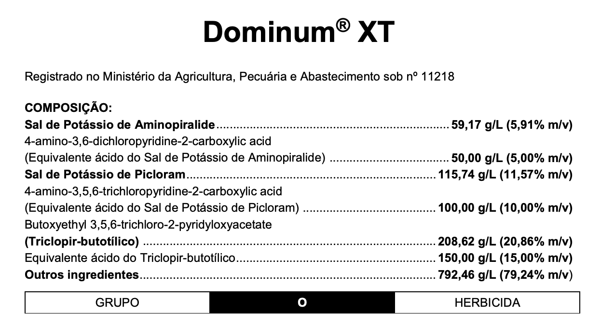
```

---


# Grupo 0 (Mimetizadores da auxina)

- **fluroxipir-meptilico + aminopiralide** (Dominum<sup>®</sup> - 1 a 2,5 L pc ha<sup>-1</sup>)

- **fluroxipir-meptilico + picloram** (Arreio Pasto<sup>®</sup> - 1,5 a 2,5 L pc ha<sup>-1</sup>)

- **fluroxipir-meptilico + triclopir-butotilico** (Truper<sup>®</sup> - 2 a 4 L pc ha<sup>-1</sup>)

- **2,4-D + aminopiralide** (Tordon XT<sup>®</sup> - 1 a 2,5 L pc ha<sup>-1</sup>)

- **2,4-D + picloram** (Jacaré<sup>®</sup> - 3,5 a 5 L pc ha<sup>-1</sup>)

    - Aplicação foliar área total / dirigida (costal)

    -  Folhas largas, semi-arbustivas e arbustivas em áreas de pastagens de gramíneas forrageiras

    - Reforma e manutenção de pastagem / área total 


---

# Considerações com o controle químico

## Aplicação foliar localizada/basal?


```{r echo=FALSE, out.width=1000, fig.align='center'}
knitr::include_graphics("https://s7d4.scene7.com/is/image/dpagco/IMG_spraying_mesquite_1_Beauty_2_88-1?$textonimage_desktop$")
```
Imagem: Corteva-EUA

---

## Aplicação aérea?

```{r echo=FALSE, out.width=900, fig.align='center'}
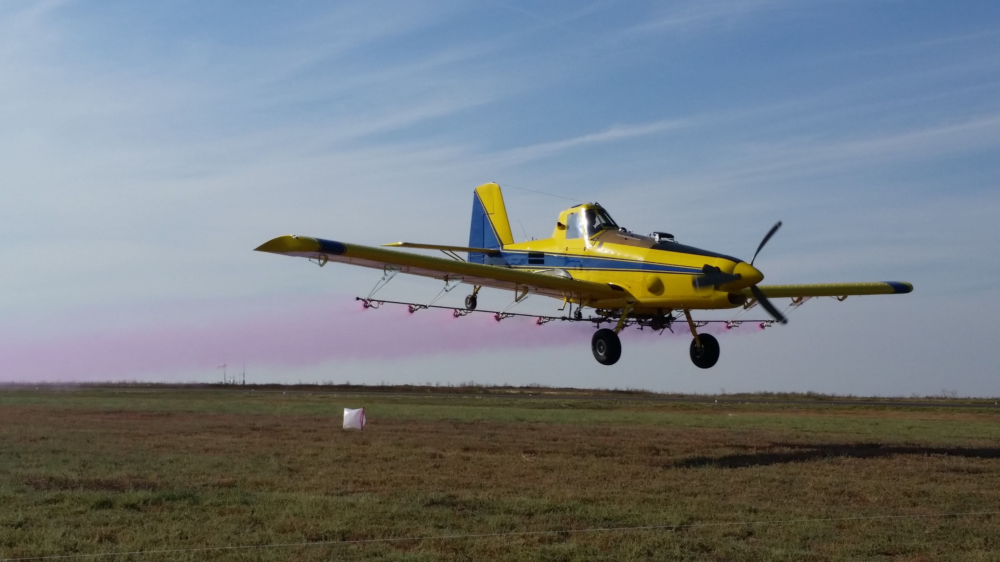
```
Imagem: Bruno C Vieira

---

## Aplicação em área total?


```{r echo=FALSE, out.width=800, fig.align='center'}
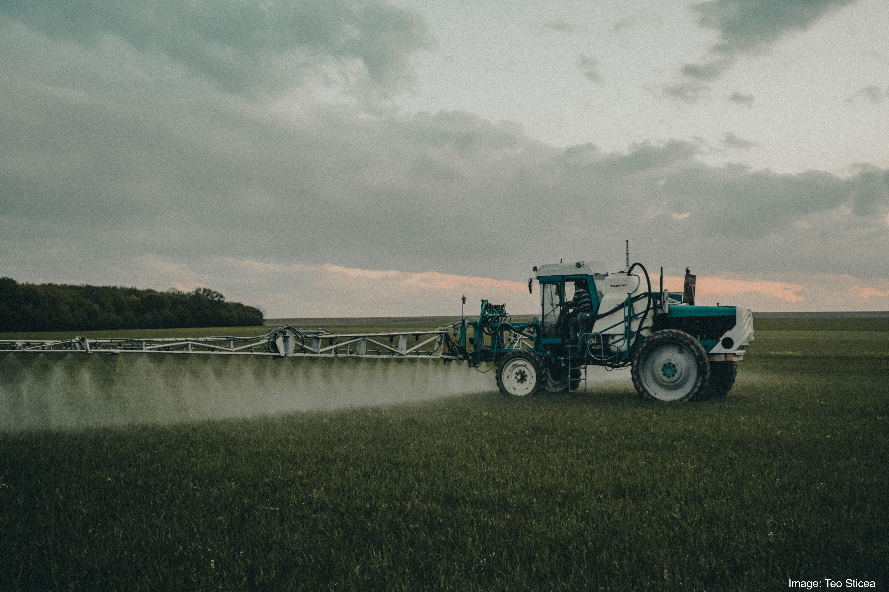
```


---

## Enxada química?


```{r echo=FALSE, out.width=700, fig.align='center'}
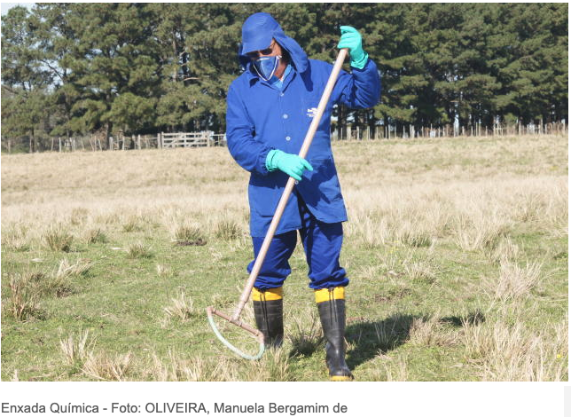
```

---


# Tecnologia de aplicação


.pull-left[
- Volume da calda

- Bicos

- Pressão de trabalho
]

.pull-right[
- Temperatura

- Umidade

- Vento
]

```{r echo=FALSE, out.width=700, fig.align='center'}
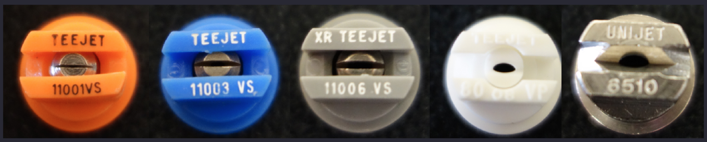
```


```{r echo=FALSE, out.width=700, fig.align='center'}
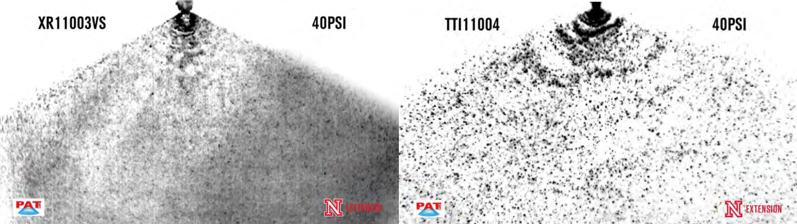
```
---

# Tecnologia de aplicação

- Doses

- Cobertura

```{r echo=FALSE, out.width=600, fig.align='center'}
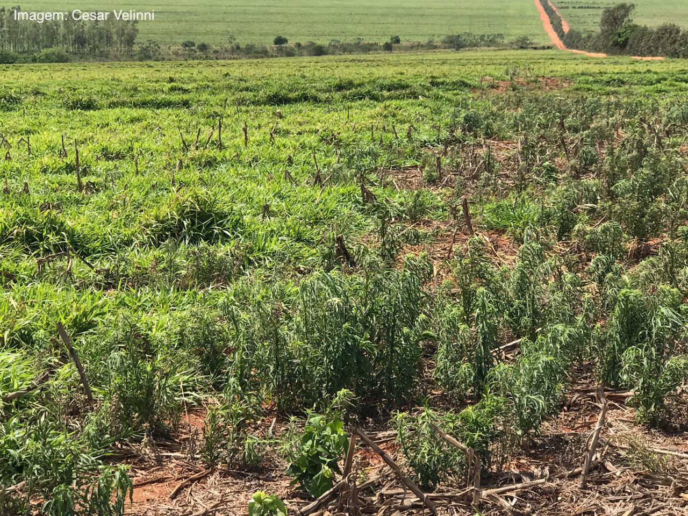
```

---

# Tecnologia de aplicação

- Misturas de herbicidas


```{r echo=FALSE, out.width=500, fig.align='center'}
knitr::include_graphics("https://media.giphy.com/media/XDdeAjKMIo3JFTPA8q/giphy.gif")
```

---

# Cuidados

.pull-left[
## Residual de herbicidas (*Carryover*)
- Picloram em café (Fonte: UFV)
```{r echo=FALSE, out.width=400, fig.align='center'}
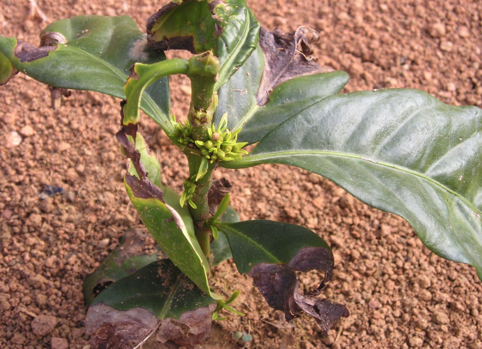
```
]

.pull-right[
## Deriva
- Deriva de 2,4-D/dicamba em soja
```{r echo=FALSE, out.width=400, fig.align='center'}
knitr::include_graphics("images/auxin_3.jpg")
```
]


---

# Cuidados

- Classificacão toxicologia/meio ambiente

- Manuseio dos produtos

```{r echo=FALSE, out.width=700, fig.align='center'}
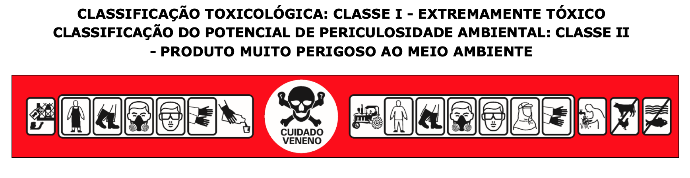
```


---


# Considerações finais

- Manejo de plantas daninhas faz parte do sistema de produção de pastagens/sementes

    - As plantas daninhas são onipresentes
--

- O manejo de pastagem no Brasil permite a integração com outras culturas

    - Sistemas agroflorestais
    
    - Integração lavoura pecuária
    
    - Rotação de culturas
--

- Herbicidas facilitam o manejo de plantas daninhas em pastagens
    
    - Boas opcões de produtos químicos
    
    - Faltam dados de posicionamento
        
          - Qual a melhor época de aplicação?


---

class: inverse, middle, center

# Obrigado


Maxwel Coura Oliveira

maxweloliveira@unoeste.br

https://maxweeds.rbind.io/pt/

```{r eval=FALSE, include=FALSE}
xaringanExtra::use_webcam()
```


```{r xaringan-tachyons, echo=FALSE, include=FALSE}
xaringanExtra::use_tachyons()
```

```{r xaringan-tile-view, echo=FALSE, include=FALSE}
xaringanExtra::use_tile_view()
```


```{r share-again, echo=FALSE, include=FALSE}
xaringanExtra::use_share_again()
```

```{r broadcast, echo=FALSE, include=FALSE}
xaringanExtra::use_broadcast()
```